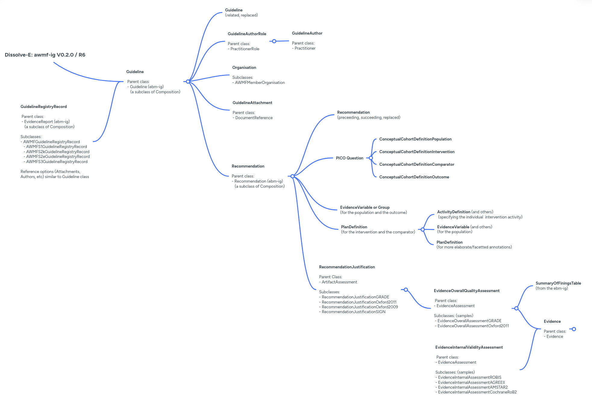

# DISSOLVE-E Implementation Guide - Dissolve-E: AWMF Guideline Registry v0.2.0

* [**Table of Contents**](toc.md)
* **DISSOLVE-E Implementation Guide**

## DISSOLVE-E Implementation Guide

| | |
| :--- | :--- |
| *Official URL*:http://fhir.awmf.org/awmf.ig/ImplementationGuide/awmf.ig | *Version*:0.2.0 |
| Draft as of 2026-01-29 | *Computable Name*:AWMFGuidelineRegistryIG |

# Dissolve-E - Digitization of the AWMF guideline registry for an open, guideline-based, trustworthy evidence ecosystem

### Background

Dissolve-E (**Digitization of the AWMF guideline registry for an open, guideline-based, trustworthy evidence ecosystem**) aims to digitize the guidelines registry maintained by the Association of the Scientific Medical Societies in Germany (AWMF). This registry plays a crucial role in ensuring quality medical care by providing evidence-based clinical guidelines. However, this registry is currently analog without comprehensive digital version existing yet.

**Potential Objectives and Benefits are:**

* Developing a digital infrastructure that meets national and international technical standards and requirements;
* Ideally facilitating the creation, updating, and access of clinical guidelines;
* Providing tailored formats and decision-support tools for medical professionals;
* Potentially enabling efficient real-time comparison between guideline recommendations, treatment options, and latest scientific findings.

### Summary

We hereby present the Implementation Guide (IG) developed for DISSOLVE-E based combining the [evidence-based medicine on FHIR (EBMonFHIR)][EMBonFHIR] IG and further defined artifacts to represent evidence-based clinical practice guidelines and recommendations, including the evidence that led to the single recommendations. Additional FHIR artifacts allow to describe the certainty of evidence based on different rating systems or the strength of recommendation, as well as the organizations and persons involved in the guideline process.

This IG is based on FHIR R6 (6.0.0-ballot3).

#### Profiles to represent a clinical practice guideline

While DISSOLVE-E is initiated by the AWMF and foremost aiming to develop a digital guidelines registry for Germany, we propose a general guideline profile as well as registry-specific profiles including AWMF specific requirements.

| | | |
| :--- | :--- | :--- |
| [Guideline](StructureDefinition-awmf-guideline.md) | [Composition](http://build.fhir.org/composition.html) | Representation of a general clinical practice guideline. |
| [Guideline Attachment](StructureDefinition-guideline-attachment.md) | [DocumentReference](http://build.fhir.org/documentreference.html) | Representation of an attachment to a clinical practice guideline. |
| [Guideline Registry Record](StructureDefinition-guideline-registry-record.md) | [Composition](http://build.fhir.org/composition.html) | Representation of a guideline registry record containing metadata and registry-specific information. |
| [AWMF S1 Guideline Registry Record](StructureDefinition-awmf-guideline-record-s1.md) | [Composition](http://build.fhir.org/composition.html) | Representation of an AWMF S1 guideline registry record encompassing expert recommendations developed through informal consensus. |
| [AWMF S2e Guideline Registry Record](StructureDefinition-awmf-guideline-record-s2e.md) | [Composition](http://build.fhir.org/composition.html) | Representation of an AWMF S2e guideline registry record based on systematic literature search and evaluation. |
| [AWMF S2k Guideline Registry Record](StructureDefinition-awmf-guideline-record-s2k.md) | [Composition](http://build.fhir.org/composition.html) | Representation of an AWMF S2k guideline registry record based on structured consensus by a representative panel. |
| [AWMF S3 Guideline Registry Record](StructureDefinition-awmf-guideline-record-s3.md) | [Composition](http://build.fhir.org/composition.html) | Representation of an AWMF S3 guideline registry record based on systematic evidence review and structured consensus by a representative panel. |

#### Profile to represent a recommendation

| | | |
| :--- | :--- | :--- |
| [Recommendation](StructureDefinition-recommendation.md) | [Composition](http://build.fhir.org/composition.html) | Representation of a clinical practice guideline recommendation. |

##### Profiles to represent the evidence assessment upon which a clinical practice guideline recommendation is based

We propose a general profile as well as profiles based on different quality and risk of bias assessment systems.

| | | |
| :--- | :--- | :--- |
| [Evidence Overall Quality Assessment](StructureDefinition-evidence-overall-quality-assessment.md) | [ArtifactAssessment](http://build.fhir.org/artifactassessment.html) | General representation of a certainty of evidence rating, possibly outcome-specific. |
| [Evidence Internal Validity Assessment](StructureDefinition-evidence-internal-validity-assessment.md) | [ArtifactAssessment](http://build.fhir.org/artifactassessment.html) | Assessment of the internal validity of evidence. |
| [Evidence Internal Assessment AGREE II](StructureDefinition-evidence-internal-assessment-agreeii.md) | [ArtifactAssessment](http://build.fhir.org/artifactassessment.html) | Assessment of guideline quality using the AGREE II instrument. |
| [Evidence Internal Assessment AMSTAR 2](StructureDefinition-evidence-internal-assessment-amstar2.md) | [ArtifactAssessment](http://build.fhir.org/artifactassessment.html) | Assessment of systematic review quality using AMSTAR 2. |
| [Evidence Internal Assessment Cochrane Risk of Bias](StructureDefinition-evidence-internal-assessment-cochrane-rob.md) | [ArtifactAssessment](http://build.fhir.org/artifactassessment.html) | Assessment of risk of bias using Cochrane RoB tool. |
| [Evidence Internal Assessment ROBIS](StructureDefinition-evidence-internal-assessment-robis.md) | [ArtifactAssessment](http://build.fhir.org/artifactassessment.html) | Assessment of risk of bias using ROBIS (Risk of Bias in Systematic Reviews). |
| [Evidence Overall Quality Assessment](StructureDefinition-evidence-overall-quality-assessment.md) | [ArtifactAssessment](http://build.fhir.org/artifactassessment.html) | Overall assessment of evidence quality. |
| [Evidence Overall Assessment GRADE](StructureDefinition-evidence-overall-assessment-grade.md) | [ArtifactAssessment](http://build.fhir.org/artifactassessment.html) | Overall assessment of evidence certainty using GRADE. |
| [Evidence Overall Assessment Oxford 2011](StructureDefinition-evidence-overall-assessment-oxford2011.md) | [ArtifactAssessment](http://build.fhir.org/artifactassessment.html) | Overall assessment of evidence certainty using Oxford 2011 levels of evidence. |

##### Profiles to represent the recommendation justification

We propose a general profile as well as specific profiles based on various internationally recognized rating systems used to describe the strength of recommendation:

| | | |
| :--- | :--- | :--- |
| [Recommendation Justification](StructureDefinition-recommendation-justification.md) | [ArtifactAssessment](http://build.fhir.org/artifactassessment.html) | General representation of a structured assessment of the evidence and consensus that underpins a recommendation. |
| [Recommendation Justification AWMF](StructureDefinition-recommendation-justification-awmf.md) | [ArtifactAssessment](http://build.fhir.org/artifactassessment.html) | Recommendation justification including AWMF strength of recommendation rating. |
| [Recommendation Justification Expert Consensus](StructureDefinition-recommendation-justification-expert-consensus.md) | [ArtifactAssessment](http://build.fhir.org/artifactassessment.html) | Recommendation justification based on expert consensus. |
| [Recommendation Justification GRADE](StructureDefinition-recommendation-justification-grade.md) | [ArtifactAssessment](http://build.fhir.org/artifactassessment.html) | Recommendation justification including GRADE strength of recommendation rating. |
| [Recommendation Justification OXFORD 2009](StructureDefinition-recommendation-justification-oxford-2009.md) | [ArtifactAssessment](http://build.fhir.org/artifactassessment.html) | Recommendation justification including Oxford 2009 grade of recommendation. |
| [Recommendation Justification OXFORD 2011](StructureDefinition-recommendation-justification-oxford-2011.md) | [ArtifactAssessment](http://build.fhir.org/artifactassessment.html) | Recommendation justification including Oxford 2011 grade of recommendation. |
| [Recommendation Justification SIGN](StructureDefinition-recommendation-justification-sign.md) | [ArtifactAssessment](http://build.fhir.org/artifactassessment.html) | Recommendation justification including SIGN grade of recommendation. |

#### Profiles for PICO Questions

To support structured representation of clinical questions, we provide profiles for PICO (Population, Intervention, Comparator, Outcome) questions:

| | | |
| :--- | :--- | :--- |
| [PICO Question](StructureDefinition-pico-question.md) | [Group](http://build.fhir.org/group.html) | Structured definition of a PICO question in the context of guidelines and recommendations. |
| [Conceptual Cohort Definition Population](StructureDefinition-conceptual-cohort-definition-population.md) | [Group](http://build.fhir.org/group.html) | Definition of the population in a PICO question. |
| [Conceptual Cohort Definition Intervention](StructureDefinition-conceptual-cohort-definition-intervention.md) | [Group](http://build.fhir.org/group.html) | Definition of the intervention in a PICO question. |
| [Conceptual Cohort Definition Comparator](StructureDefinition-conceptual-cohort-definition-comparator.md) | [Group](http://build.fhir.org/group.html) | Definition of the comparator in a PICO question. |
| [Conceptual Cohort Definition Outcome](StructureDefinition-conceptual-cohort-definition-outcome.md) | [Group](http://build.fhir.org/group.html) | Definition of the outcome in a PICO question. |

#### Profiles for involved Organizations and Persons

| | | |
| :--- | :--- | :--- |
| [AWMF Member Organization](StructureDefinition-awmf-member-organization.md) | [Organization](http://build.fhir.org/organization.html) | Representation of an organization that is a member of the AWMF. |
| [Medical Society](StructureDefinition-medical-society.md) | [Organization](http://build.fhir.org/organization.html) | Representation of a medical society involved in guideline development. |
| [Patient Organization](StructureDefinition-patient-organization.md) | [Organization](http://build.fhir.org/organization.html) | Representation of a patient organization involved in guideline development. |
| [Guideline Author](StructureDefinition-guideline-author.md) | [Practitioner](http://build.fhir.org/practitioner.html) | Representation of a person that authored a guideline. |
| [Guideline Author Role](StructureDefinition-ext-guideline-author-role.md) | [PractitionerRole](http://build.fhir.org/practitionerrole.html) | Representation of the role of the author of the guideline. |

#### Other Profiles

| | | |
| :--- | :--- | :--- |
| [Outcome Evidence](StructureDefinition-outcome-evidence.md) | [Evidence](http://build.fhir.org/evidence.html) | Representation of evidence for a specific outcome. |
| [Citation List](StructureDefinition-citation-list.md) | [Citation](http://build.fhir.org/citation.html) | Representation of a list of citations supporting recommendations or evidence. |

### Graphical Overview of the FHIR Resources

The following diagramm provides an overview of the diverse profiles used in this the DISSOLVE-E-IG and their relationship allowing for a structured representation of clinical practice guidelines with accompanying evidence and evidence-to-decision information. The cardinalities shown represent the respective maxima. Please consult the pages of the respective [profiles](profiles.md) for additional details.



### Authors (in alphabetical order) with Affiliations

* [Sophie Klopfenstein](https://github.com/klsophie) (Berlin Institute of Health at Charité)
* [Gregor Lichtner](https://github.com/glichtner) (University Medicine Greifswald)
* Ina Müller (Association of the Scientific Medical Societies in Germany)
* [Johannes Starlinger](https://github.com/starlinger) (Howto Health GmbH)

### Contributing Organisations (in alphabetical order)

* Association of the Scientific Medical Societies in Germany (AWMF)
* aQua – Institute for Applied Quality Improvement and Research in Health Care
* Charité–Universitätsmedizin Berlin / Berlin Institute of Health
* Clinical Guideline Services GmbH
* Computable Publishing LLC, Scientific Knowledge Accelerator Foundation
* Evidence Prime Inc.
* German Cancer Society, Office Leitlinienprogramm Onkologie
* German Society for Wound Healing and Wound Treatment e.V.
* German Society of Internal Medicine
* HL7 Germany
* Howto Health GmbH
* Institute for Evidence in Medicine, University of Freiburg
* MAGIC Evidence Ecosystem Foundation
* University Medicine Greifswalds

### Further information

#### Ethical Considerations

**The Ethics Committee of the Berlin chamber of physicians in accordance with its code of conduct §15 section 1 (Eth-KB-24-11) confirmed that no ethical approval is needed for this study.**

#### Funding Information

This project is publicly funded by the Innovation Committee of the Federal Joint Committee (German: Gemeinsamer Bundesausschuss, short: G-BA) for three years (April 2024 to March 2027) with a total of around 2.8 million euros under the grant number: 01VSF23021.

#### Links

* DISSOLVE-E on the Website of the Federal Joint Committee (G-BA) in [German](https://innovationsfonds.g-ba.de/projekte/versorgungsforschung/dissolve-e.597) or [English](https://www.awmf.org/die-awmf/imwi/projekte/dissolve-e-english-version)
* [GitHub project](https://github.com/Dissolve-E/awmf-ig)
* Profile definitions in the DISSOLVE-E Implementation Guide can be downloaded as a package via [https://fhir.awmf.org/awmf.ig/package.tgz](https://fhir.awmf.org/awmf.ig/package.tgz).


## Resource Content

```json
{
  "resourceType" : "ImplementationGuide",
  "id" : "awmf.ig",
  "url" : "http://fhir.awmf.org/awmf.ig/ImplementationGuide/awmf.ig",
  "version" : "0.2.0",
  "name" : "AWMFGuidelineRegistryIG",
  "title" : "Dissolve-E: AWMF Guideline Registry",
  "status" : "draft",
  "date" : "2026-01-29T18:27:10+00:00",
  "publisher" : "AWMF e.V.",
  "contact" : [
    {
      "name" : "AWMF e.V.",
      "telecom" : [
        {
          "system" : "url",
          "value" : "https://www.awmf.org"
        }
      ]
    }
  ],
  "description" : "This implementation guide, produced by the Dissolve-E project (G-BA grant 01VSF23021) in collaboration with the Association of the Scientific Medical Societies in Germany (AWMF), defines FHIR profiles, extensions, and guidance for a structured, FAIR, and interoperable representation of German clinical practice guidelines.   Built on EBMonFHIR and related international initiatives, it supports authoring workflows, version control, and seamless integration of guideline knowledge into clinical decision support, quality management, and research infrastructures.\n",
  "packageId" : "awmf.ig",
  "license" : "CC0-1.0",
  "fhirVersion" : ["6.0.0-ballot3"],
  "dependsOn" : [
    {
      "id" : "hl7_fhir_uv_ebm",
      "uri" : "http://hl7.org/fhir/uv/ebm",
      "packageId" : "hl7.fhir.uv.ebm",
      "version" : "ci-build"
    },
    {
      "id" : "hl7_fhir_r6_core",
      "uri" : "http://hl7.org/fhir/ImplementationGuide/fhir",
      "packageId" : "hl7.fhir.r6.core",
      "version" : "6.0.0-ballot3"
    },
    {
      "id" : "hl7_fhir_uv_extensions",
      "uri" : "http://hl7.org/fhir/extensions/ImplementationGuide/hl7.fhir.uv.extensions",
      "packageId" : "hl7.fhir.uv.extensions",
      "version" : "5.3.0-ballot-tc1"
    },
    {
      "id" : "hl7_terminology",
      "uri" : "http://terminology.hl7.org/ImplementationGuide/hl7.terminology",
      "packageId" : "hl7.terminology",
      "version" : "7.0.1"
    }
  ],
  "definition" : {
    "extension" : [
      {
        "url" : "http://hl7.org/fhir/tools/StructureDefinition/ig-internal-dependency",
        "valueCode" : "hl7.fhir.uv.tools.r5#0.9.0"
      }
    ],
    "resource" : [
      {
        "extension" : [
          {
            "url" : "http://hl7.org/fhir/tools/StructureDefinition/resource-information",
            "valueString" : "CodeSystem"
          }
        ],
        "reference" : {
          "reference" : "CodeSystem/cs-agree-ii-domains"
        },
        "name" : "AGREE II Domains",
        "description" : "CodeSystem representing the domains assessed by the AGREE II instrument for evaluating the quality of clinical practice guidelines.",
        "isExample" : false
      },
      {
        "extension" : [
          {
            "url" : "http://hl7.org/fhir/tools/StructureDefinition/resource-information",
            "valueString" : "ValueSet"
          }
        ],
        "reference" : {
          "reference" : "ValueSet/vs-agree-ii-domains"
        },
        "name" : "AGREE II Domains Value Set",
        "description" : "ValueSet encompassing all domains from the AGREE II instrument.",
        "isExample" : false
      },
      {
        "extension" : [
          {
            "url" : "http://hl7.org/fhir/tools/StructureDefinition/resource-information",
            "valueString" : "ValueSet"
          }
        ],
        "reference" : {
          "reference" : "ValueSet/vs-amstar2-confidence-ratings"
        },
        "name" : "AMSTAR 2 Confidence Ratings Value Set",
        "description" : "ValueSet encompassing all overall confidence ratings from the AMSTAR 2 critical appraisal tool.",
        "isExample" : false
      },
      {
        "extension" : [
          {
            "url" : "http://hl7.org/fhir/tools/StructureDefinition/resource-information",
            "valueString" : "CodeSystem"
          }
        ],
        "reference" : {
          "reference" : "CodeSystem/cs-amstar2-confidence-ratings"
        },
        "name" : "AMSTAR 2 Overall Confidence Ratings",
        "description" : "CodeSystem representing the overall confidence ratings from the AMSTAR 2 critical appraisal tool.",
        "isExample" : false
      },
      {
        "extension" : [
          {
            "url" : "http://hl7.org/fhir/tools/StructureDefinition/resource-information",
            "valueString" : "Organization"
          }
        ],
        "reference" : {
          "reference" : "Organization/AWMF"
        },
        "name" : "Arbeitsgemeinschaft der Wissenschaftlichen Medizinischen Fachgesellschaften (AWMF)",
        "description" : "Arbeitsgemeinschaft der Wissenschaftlichen Medizinischen Fachgesellschaften (AWMF)",
        "isExample" : true
      },
      {
        "extension" : [
          {
            "url" : "http://hl7.org/fhir/tools/StructureDefinition/resource-information",
            "valueString" : "StructureDefinition:extension"
          }
        ],
        "reference" : {
          "reference" : "StructureDefinition/ext-artifact-extended-contact"
        },
        "name" : "Artifact Contact (Extended)",
        "description" : "This extension provides additional contact details for individuals or organizations associated with an artifact (e.g., a clinical document, guideline, or other composition).",
        "isExample" : false
      },
      {
        "extension" : [
          {
            "url" : "http://hl7.org/fhir/tools/StructureDefinition/resource-information",
            "valueString" : "StructureDefinition:extension"
          }
        ],
        "reference" : {
          "reference" : "StructureDefinition/ext-author-language"
        },
        "name" : "Author Language",
        "description" : "This extension allows for the specification of the language(s) the author contributed to a section in a FHIR Composition.",
        "isExample" : false
      },
      {
        "extension" : [
          {
            "url" : "http://hl7.org/fhir/tools/StructureDefinition/resource-information",
            "valueString" : "CodeSystem"
          }
        ],
        "reference" : {
          "reference" : "CodeSystem/cs-awmf"
        },
        "name" : "awmf",
        "description" : "CodeSystem representing different codes of interest for the Arbeitsgemeinschaft der Wissenschaftlichen Medizinischen Fachgesellschaften (AWMF)",
        "isExample" : false
      },
      {
        "extension" : [
          {
            "url" : "http://hl7.org/fhir/tools/StructureDefinition/resource-information",
            "valueString" : "ValueSet"
          }
        ],
        "reference" : {
          "reference" : "ValueSet/vs-awmf-guideline-class"
        },
        "name" : "AWMF Guideline Class",
        "description" : "ValueSet listing values representing guideline classes according to the AWMF.",
        "isExample" : false
      },
      {
        "extension" : [
          {
            "url" : "http://hl7.org/fhir/tools/StructureDefinition/resource-information",
            "valueString" : "CodeSystem"
          }
        ],
        "reference" : {
          "reference" : "CodeSystem/cs-awmf-guideline-class"
        },
        "name" : "AWMF Guideline Class",
        "description" : "As part of the project planning for the creation or updating of a guideline,\n    a decision should be made at an early stage about the planned level classification (\"S classification\") according to the AWMF's system of rules (1-3).\n    The S-classification scheme of the AWMF differentiates between the classes S1 treatment recommendation as well as S2e, S2k and S3 guideline.\n    The \"S\" stands for the extent of the applied systematic approach in the development process of a guideline.\n    Each class thus stands for a specific methodological concept that must be presented in a way that is comprehensible to the users.\n    The choice of class is based on the question of how much effort is appropriate and feasible.\n    The need for legitimacy for the implementation of the guideline (convincing the target group) must be taken into account.\n    When choosing a higher S-classification in the context of updating a guideline, the adaptation to the corresponding methodology has to be considered.",
        "isExample" : false
      },
      {
        "extension" : [
          {
            "url" : "http://hl7.org/fhir/tools/StructureDefinition/resource-information",
            "valueString" : "Composition"
          }
        ],
        "reference" : {
          "reference" : "Composition/AWMFGuidelineRecordS3Example"
        },
        "name" : "AWMF Guideline Record S3 Example",
        "description" : "An example of an AWMF S3 guideline.",
        "isExample" : true,
        "profile" : [
          "http://fhir.awmf.org/awmf.ig/StructureDefinition/awmf-guideline-record-s3"
        ]
      },
      {
        "extension" : [
          {
            "url" : "http://hl7.org/fhir/tools/StructureDefinition/resource-information",
            "valueString" : "Composition"
          }
        ],
        "reference" : {
          "reference" : "Composition/AWMFGuidelineS1Example"
        },
        "name" : "AWMF Guideline S1 Example",
        "description" : "An example of an AWMF S1 guideline.",
        "isExample" : true,
        "profile" : [
          "http://fhir.awmf.org/awmf.ig/StructureDefinition/awmf-guideline-record-s1"
        ]
      },
      {
        "extension" : [
          {
            "url" : "http://hl7.org/fhir/tools/StructureDefinition/resource-information",
            "valueString" : "Composition"
          }
        ],
        "reference" : {
          "reference" : "Composition/AWMFGuidelineS2eExample"
        },
        "name" : "AWMF Guideline S2e Example",
        "description" : "An example of an AWMF S2e guideline.",
        "isExample" : true,
        "profile" : [
          "http://fhir.awmf.org/awmf.ig/StructureDefinition/awmf-guideline-record-s2e"
        ]
      },
      {
        "extension" : [
          {
            "url" : "http://hl7.org/fhir/tools/StructureDefinition/resource-information",
            "valueString" : "Composition"
          }
        ],
        "reference" : {
          "reference" : "Composition/AWMFGuidelineRecordS2kExample"
        },
        "name" : "AWMF Guideline S2k Example",
        "description" : "An example of an AWMF S2k guideline.",
        "isExample" : true,
        "profile" : [
          "http://fhir.awmf.org/awmf.ig/StructureDefinition/awmf-guideline-record-s2k"
        ]
      },
      {
        "extension" : [
          {
            "url" : "http://hl7.org/fhir/tools/StructureDefinition/resource-information",
            "valueString" : "ValueSet"
          }
        ],
        "reference" : {
          "reference" : "ValueSet/vs-awmf-guideline-status"
        },
        "name" : "AWMF Guideline Status",
        "description" : "ValueSet listing values to define the guideline status according to the AWMF.",
        "isExample" : false
      },
      {
        "extension" : [
          {
            "url" : "http://hl7.org/fhir/tools/StructureDefinition/resource-information",
            "valueString" : "CodeSystem"
          }
        ],
        "reference" : {
          "reference" : "CodeSystem/cs-awmf-guideline-status"
        },
        "name" : "AWMF Guideline Status",
        "description" : "CodeSystem representing the guideline status according to the AWMF.",
        "isExample" : false
      },
      {
        "extension" : [
          {
            "url" : "http://hl7.org/fhir/tools/StructureDefinition/resource-information",
            "valueString" : "StructureDefinition:resource"
          }
        ],
        "reference" : {
          "reference" : "StructureDefinition/awmf-member-organization"
        },
        "name" : "AWMF Member Organization",
        "description" : "An organization that is a member of the AWMF",
        "isExample" : false
      },
      {
        "extension" : [
          {
            "url" : "http://hl7.org/fhir/tools/StructureDefinition/resource-information",
            "valueString" : "Organization"
          }
        ],
        "reference" : {
          "reference" : "Organization/AWMFMemberOrganizationExample"
        },
        "name" : "AWMF Member Organization Example",
        "description" : "An example of an AWMF member organization.",
        "isExample" : true,
        "profile" : [
          "http://fhir.awmf.org/awmf.ig/StructureDefinition/awmf-member-organization"
        ]
      },
      {
        "extension" : [
          {
            "url" : "http://hl7.org/fhir/tools/StructureDefinition/resource-information",
            "valueString" : "StructureDefinition:resource"
          }
        ],
        "reference" : {
          "reference" : "StructureDefinition/awmf-guideline-record-s1"
        },
        "name" : "AWMF S1 Guideline Registry Record",
        "description" : "AWMF S1 guideline representing expert recommendations developed through informal consensus.",
        "isExample" : false
      },
      {
        "extension" : [
          {
            "url" : "http://hl7.org/fhir/tools/StructureDefinition/resource-information",
            "valueString" : "StructureDefinition:resource"
          }
        ],
        "reference" : {
          "reference" : "StructureDefinition/awmf-guideline-record-s2e"
        },
        "name" : "AWMF S2e Guideline Registry Record",
        "description" : "AWMF S2e guideline based on systematic literature search and evaluation.",
        "isExample" : false
      },
      {
        "extension" : [
          {
            "url" : "http://hl7.org/fhir/tools/StructureDefinition/resource-information",
            "valueString" : "StructureDefinition:resource"
          }
        ],
        "reference" : {
          "reference" : "StructureDefinition/awmf-guideline-record-s2k"
        },
        "name" : "AWMF S2k Guideline Registry Record",
        "description" : "AWMF S2k guideline based on structured consensus by a representative panel.",
        "isExample" : false
      },
      {
        "extension" : [
          {
            "url" : "http://hl7.org/fhir/tools/StructureDefinition/resource-information",
            "valueString" : "StructureDefinition:resource"
          }
        ],
        "reference" : {
          "reference" : "StructureDefinition/awmf-guideline-record-s3"
        },
        "name" : "AWMF S3 Guideline Registry Record",
        "description" : "AWMF S3 guideline based on systematic evidence review and structured consensus by a representative panel.",
        "isExample" : false
      },
      {
        "extension" : [
          {
            "url" : "http://hl7.org/fhir/tools/StructureDefinition/resource-information",
            "valueString" : "ValueSet"
          }
        ],
        "reference" : {
          "reference" : "ValueSet/vs-body-system-conditions"
        },
        "name" : "Body System Conditions",
        "description" : "ValueSet listing various body system conditions",
        "isExample" : false
      },
      {
        "extension" : [
          {
            "url" : "http://hl7.org/fhir/tools/StructureDefinition/resource-information",
            "valueString" : "CodeSystem"
          }
        ],
        "reference" : {
          "reference" : "CodeSystem/cs-body-systems-conditions"
        },
        "name" : "Body System Conditions",
        "description" : "CodeSystem representing various body system conditions.",
        "isExample" : false
      },
      {
        "extension" : [
          {
            "url" : "http://hl7.org/fhir/tools/StructureDefinition/resource-information",
            "valueString" : "ValueSet"
          }
        ],
        "reference" : {
          "reference" : "ValueSet/vs-care-level"
        },
        "name" : "Care Level",
        "description" : "ValueSet listing levels of care.",
        "isExample" : false
      },
      {
        "extension" : [
          {
            "url" : "http://hl7.org/fhir/tools/StructureDefinition/resource-information",
            "valueString" : "CodeSystem"
          }
        ],
        "reference" : {
          "reference" : "CodeSystem/cs-care-setting"
        },
        "name" : "Care Setting",
        "description" : "CodeSystem defining different care settings, including levels of care, healthcare services, and treatment contexts.",
        "isExample" : false
      },
      {
        "extension" : [
          {
            "url" : "http://hl7.org/fhir/tools/StructureDefinition/resource-information",
            "valueString" : "ValueSet"
          }
        ],
        "reference" : {
          "reference" : "ValueSet/vs-care-stage"
        },
        "name" : "Care Stage",
        "description" : "ValueSet listing stages of care from prevention to rehabilitation.",
        "isExample" : false
      },
      {
        "extension" : [
          {
            "url" : "http://hl7.org/fhir/tools/StructureDefinition/resource-information",
            "valueString" : "ArtifactAssessment"
          }
        ],
        "reference" : {
          "reference" : "ArtifactAssessment/EvA-MultiplexPCRDiagnostic-AntibioticDays"
        },
        "name" : "Certainty of Evidence Rating for Multiplex-PCR-Diagnostik - Antibiotic Days",
        "description" : "Certainty of evidence rating for the impact of Multiplex-PCR-Diagnostik on antibiotic days",
        "isExample" : true,
        "profile" : [
          "http://fhir.awmf.org/awmf.ig/StructureDefinition/evidence-overall-assessment-grade"
        ]
      },
      {
        "extension" : [
          {
            "url" : "http://hl7.org/fhir/tools/StructureDefinition/resource-information",
            "valueString" : "ArtifactAssessment"
          }
        ],
        "reference" : {
          "reference" : "ArtifactAssessment/EvA-MultiplexPCRDiagnostic-Mortality"
        },
        "name" : "Certainty of Evidence Rating for Multiplex-PCR-Diagnostik - Mortality",
        "description" : "Certainty of evidence rating for the impact of Multiplex-PCR-Diagnostik on mortality",
        "isExample" : true,
        "profile" : [
          "http://fhir.awmf.org/awmf.ig/StructureDefinition/evidence-overall-assessment-grade"
        ]
      },
      {
        "extension" : [
          {
            "url" : "http://hl7.org/fhir/tools/StructureDefinition/resource-information",
            "valueString" : "ArtifactAssessment"
          }
        ],
        "reference" : {
          "reference" : "ArtifactAssessment/EvA-MultiplexPCRDiagnostic-TimeToDeescalation"
        },
        "name" : "Certainty of Evidence Rating for Multiplex-PCR-Diagnostik - Time to Deescalation",
        "description" : "Certainty of evidence rating for the impact of Multiplex-PCR-Diagnostik on time to deescalation",
        "isExample" : true,
        "profile" : [
          "http://fhir.awmf.org/awmf.ig/StructureDefinition/evidence-overall-assessment-grade"
        ]
      },
      {
        "extension" : [
          {
            "url" : "http://hl7.org/fhir/tools/StructureDefinition/resource-information",
            "valueString" : "ArtifactAssessment"
          }
        ],
        "reference" : {
          "reference" : "ArtifactAssessment/RoB-CognitiveTestsWhenSuspectingDementia-Sensitivity"
        },
        "name" : "Certainty of Evidence Rating Ris of Bias for Cognitive Tests When Suspecting Dementia - Sensitivity",
        "description" : "Certainty of Evidence Rating Ris of Bias for Cognitive Tests When Suspecting Dementia on Sensitivity",
        "isExample" : true,
        "profile" : [
          "http://fhir.awmf.org/awmf.ig/StructureDefinition/evidence-internal-assessment-cochrane-rob"
        ]
      },
      {
        "extension" : [
          {
            "url" : "http://hl7.org/fhir/tools/StructureDefinition/resource-information",
            "valueString" : "ArtifactAssessment"
          }
        ],
        "reference" : {
          "reference" : "ArtifactAssessment/RoB-CognitiveTestsWhenSuspectingDementia-Specificity"
        },
        "name" : "Certainty of Evidence Rating Ris of Bias for Cognitive Tests When Suspecting Dementia - Specificity",
        "description" : "Certainty of Evidence Rating Ris of Bias for Cognitive Tests When Suspecting Dementia on Specificity",
        "isExample" : true,
        "profile" : [
          "http://fhir.awmf.org/awmf.ig/StructureDefinition/evidence-internal-assessment-cochrane-rob"
        ]
      },
      {
        "extension" : [
          {
            "url" : "http://hl7.org/fhir/tools/StructureDefinition/resource-information",
            "valueString" : "StructureDefinition:resource"
          }
        ],
        "reference" : {
          "reference" : "StructureDefinition/citation-list"
        },
        "name" : "Citation List",
        "description" : "List of citations.",
        "isExample" : false
      },
      {
        "extension" : [
          {
            "url" : "http://hl7.org/fhir/tools/StructureDefinition/resource-information",
            "valueString" : "Citation"
          }
        ],
        "reference" : {
          "reference" : "Citation/CitationSystematicReviewTsoi2015"
        },
        "name" : "Citation Systematic Review",
        "description" : "Citation for the Systematic Review by Tsoi et al. 2015",
        "isExample" : true
      },
      {
        "extension" : [
          {
            "url" : "http://hl7.org/fhir/tools/StructureDefinition/resource-information",
            "valueString" : "ValueSet"
          }
        ],
        "reference" : {
          "reference" : "ValueSet/vs-clinical-application-type"
        },
        "name" : "Clinical Application Type",
        "description" : "ValueSet listing different clinical application types",
        "isExample" : false
      },
      {
        "extension" : [
          {
            "url" : "http://hl7.org/fhir/tools/StructureDefinition/resource-information",
            "valueString" : "CodeSystem"
          }
        ],
        "reference" : {
          "reference" : "CodeSystem/cs-clinical-application-type"
        },
        "name" : "Clinical Application Type",
        "description" : "CodeSystem defining different clinical application types",
        "isExample" : false
      },
      {
        "extension" : [
          {
            "url" : "http://hl7.org/fhir/tools/StructureDefinition/resource-information",
            "valueString" : "ConceptMap"
          }
        ],
        "reference" : {
          "reference" : "ConceptMap/FHIRStatusToAWMFStatus"
        },
        "name" : "Concept map from concepts from standardized vocabularies (that are not standard OMOP concepts) to Concept IDs of OMOP standard Concepts",
        "description" : "Concept map from concepts from standardized vocabularies that are not labelled as 'standard' in Athena – OHDSI Vocabularies Repository to Concept IDs from 'standard' concepts",
        "isExample" : true
      },
      {
        "extension" : [
          {
            "url" : "http://hl7.org/fhir/tools/StructureDefinition/resource-information",
            "valueString" : "StructureDefinition:resource"
          }
        ],
        "reference" : {
          "reference" : "StructureDefinition/conceptual-cohort-definition-comparator"
        },
        "name" : "Conceptual Cohort Definition Comparator",
        "description" : "A structured definition of the comparator as defined for a PICO question.",
        "isExample" : false
      },
      {
        "extension" : [
          {
            "url" : "http://hl7.org/fhir/tools/StructureDefinition/resource-information",
            "valueString" : "StructureDefinition:resource"
          }
        ],
        "reference" : {
          "reference" : "StructureDefinition/conceptual-cohort-definition-intervention"
        },
        "name" : "Conceptual Cohort Definition Intervention",
        "description" : "A structured definition of the intervention as defined for a PICO question.",
        "isExample" : false
      },
      {
        "extension" : [
          {
            "url" : "http://hl7.org/fhir/tools/StructureDefinition/resource-information",
            "valueString" : "StructureDefinition:resource"
          }
        ],
        "reference" : {
          "reference" : "StructureDefinition/conceptual-cohort-definition-outcome"
        },
        "name" : "Conceptual Cohort Definition Outcome",
        "description" : "A structured definition of the outcome as defined for a PICO question.",
        "isExample" : false
      },
      {
        "extension" : [
          {
            "url" : "http://hl7.org/fhir/tools/StructureDefinition/resource-information",
            "valueString" : "StructureDefinition:resource"
          }
        ],
        "reference" : {
          "reference" : "StructureDefinition/conceptual-cohort-definition-population"
        },
        "name" : "Conceptual Cohort Definition Population",
        "description" : "A structured definition of the population as defined for a PICO question.",
        "isExample" : false
      },
      {
        "extension" : [
          {
            "url" : "http://hl7.org/fhir/tools/StructureDefinition/resource-information",
            "valueString" : "StructureDefinition:extension"
          }
        ],
        "reference" : {
          "reference" : "StructureDefinition/ext-consultation-period"
        },
        "name" : "Consultation Period",
        "description" : "This extension allows for the indication of the period during which the guideline is open for consultation.",
        "isExample" : false
      },
      {
        "extension" : [
          {
            "url" : "http://hl7.org/fhir/tools/StructureDefinition/resource-information",
            "valueString" : "CodeSystem"
          }
        ],
        "reference" : {
          "reference" : "CodeSystem/cs-contact-point"
        },
        "name" : "Contact Point",
        "description" : "CodeSystem defining types of contact points for a guideline",
        "isExample" : false
      },
      {
        "extension" : [
          {
            "url" : "http://hl7.org/fhir/tools/StructureDefinition/resource-information",
            "valueString" : "ValueSet"
          }
        ],
        "reference" : {
          "reference" : "ValueSet/vs-content-types"
        },
        "name" : "Content Types",
        "description" : "ValueSet listing types of content that can be part of a guideline or recommendation.",
        "isExample" : false
      },
      {
        "extension" : [
          {
            "url" : "http://hl7.org/fhir/tools/StructureDefinition/resource-information",
            "valueString" : "Practitioner"
          }
        ],
        "reference" : {
          "reference" : "Practitioner/contributor0"
        },
        "name" : "contributor0",
        "isExample" : true
      },
      {
        "extension" : [
          {
            "url" : "http://hl7.org/fhir/tools/StructureDefinition/resource-information",
            "valueString" : "Practitioner"
          }
        ],
        "reference" : {
          "reference" : "Practitioner/contributor1"
        },
        "name" : "contributor1",
        "isExample" : true
      },
      {
        "extension" : [
          {
            "url" : "http://hl7.org/fhir/tools/StructureDefinition/resource-information",
            "valueString" : "Practitioner"
          }
        ],
        "reference" : {
          "reference" : "Practitioner/contributor2"
        },
        "name" : "contributor2",
        "isExample" : true
      },
      {
        "extension" : [
          {
            "url" : "http://hl7.org/fhir/tools/StructureDefinition/resource-information",
            "valueString" : "Practitioner"
          }
        ],
        "reference" : {
          "reference" : "Practitioner/contributor3"
        },
        "name" : "contributor3",
        "isExample" : true
      },
      {
        "extension" : [
          {
            "url" : "http://hl7.org/fhir/tools/StructureDefinition/resource-information",
            "valueString" : "Practitioner"
          }
        ],
        "reference" : {
          "reference" : "Practitioner/contributor4"
        },
        "name" : "contributor4",
        "isExample" : true
      },
      {
        "extension" : [
          {
            "url" : "http://hl7.org/fhir/tools/StructureDefinition/resource-information",
            "valueString" : "Organization"
          }
        ],
        "reference" : {
          "reference" : "Organization/DGAI"
        },
        "name" : "DGAI",
        "description" : "Deutsche Gesellschaft für Anästhesiologie und Intensivmedizin e.V. (DGAI)",
        "isExample" : true,
        "profile" : [
          "http://fhir.awmf.org/awmf.ig/StructureDefinition/awmf-member-organization"
        ]
      },
      {
        "extension" : [
          {
            "url" : "http://hl7.org/fhir/tools/StructureDefinition/resource-information",
            "valueString" : "Organization"
          }
        ],
        "reference" : {
          "reference" : "Organization/DGCH"
        },
        "name" : "DGCH",
        "description" : "Deutsche Gesellschaft für Chirurgie e.V. (DGCH)",
        "isExample" : true,
        "profile" : [
          "http://fhir.awmf.org/awmf.ig/StructureDefinition/awmf-member-organization"
        ]
      },
      {
        "extension" : [
          {
            "url" : "http://hl7.org/fhir/tools/StructureDefinition/resource-information",
            "valueString" : "Organization"
          }
        ],
        "reference" : {
          "reference" : "Organization/DGHM"
        },
        "name" : "DGHM",
        "description" : "Deutsche Gesellschaft für Hygiene und Mikrobiologie e.V. (DGHM)",
        "isExample" : true,
        "profile" : [
          "http://fhir.awmf.org/awmf.ig/StructureDefinition/awmf-member-organization"
        ]
      },
      {
        "extension" : [
          {
            "url" : "http://hl7.org/fhir/tools/StructureDefinition/resource-information",
            "valueString" : "Organization"
          }
        ],
        "reference" : {
          "reference" : "Organization/DGI"
        },
        "name" : "DGI",
        "description" : "Deutsche Gesellschaft für Infektiologie e.V. (DGI)",
        "isExample" : true,
        "profile" : [
          "http://fhir.awmf.org/awmf.ig/StructureDefinition/awmf-member-organization"
        ]
      },
      {
        "extension" : [
          {
            "url" : "http://hl7.org/fhir/tools/StructureDefinition/resource-information",
            "valueString" : "Organization"
          }
        ],
        "reference" : {
          "reference" : "Organization/DGIIN"
        },
        "name" : "DGIIN",
        "description" : "Deutsche Gesellschaft für Internistische Intensivmedizin und Notfallmedizin e.V. (DGIIN)",
        "isExample" : true,
        "profile" : [
          "http://fhir.awmf.org/awmf.ig/StructureDefinition/awmf-member-organization"
        ]
      },
      {
        "extension" : [
          {
            "url" : "http://hl7.org/fhir/tools/StructureDefinition/resource-information",
            "valueString" : "Organization"
          }
        ],
        "reference" : {
          "reference" : "Organization/DGIM"
        },
        "name" : "DGIM",
        "description" : "Deutsche Gesellschaft für Innere Medizin e.V. (DGIM)",
        "isExample" : true,
        "profile" : [
          "http://fhir.awmf.org/awmf.ig/StructureDefinition/awmf-member-organization"
        ]
      },
      {
        "extension" : [
          {
            "url" : "http://hl7.org/fhir/tools/StructureDefinition/resource-information",
            "valueString" : "Organization"
          }
        ],
        "reference" : {
          "reference" : "Organization/DGP"
        },
        "name" : "DGP",
        "description" : "Deutsche Gesellschaft für Pneumologie und Beatmungsmedizin e.V. (DGP)",
        "isExample" : true,
        "profile" : [
          "http://fhir.awmf.org/awmf.ig/StructureDefinition/awmf-member-organization"
        ]
      },
      {
        "extension" : [
          {
            "url" : "http://hl7.org/fhir/tools/StructureDefinition/resource-information",
            "valueString" : "Organization"
          }
        ],
        "reference" : {
          "reference" : "Organization/DGPPN"
        },
        "name" : "DGPPN",
        "description" : "Deutsche Gesellschaft für Psychiatrie und Psychotherapie, Psychosomatik und Nervenheilkunde e. V. (DGPPN)",
        "isExample" : true,
        "profile" : [
          "http://fhir.awmf.org/awmf.ig/StructureDefinition/awmf-member-organization"
        ]
      },
      {
        "extension" : [
          {
            "url" : "http://hl7.org/fhir/tools/StructureDefinition/resource-information",
            "valueString" : "ValueSet"
          }
        ],
        "reference" : {
          "reference" : "ValueSet/vs-dissemination-website"
        },
        "name" : "Dissemination Website",
        "description" : "ValueSet listing types of dissemination websites",
        "isExample" : false
      },
      {
        "extension" : [
          {
            "url" : "http://hl7.org/fhir/tools/StructureDefinition/resource-information",
            "valueString" : "Organization"
          }
        ],
        "reference" : {
          "reference" : "Organization/DRG"
        },
        "name" : "DRG",
        "description" : "Deutsche Röntgengesellschaft, Gesellschaft für Medizinische Radiologie e.V. (DRG)",
        "isExample" : true,
        "profile" : [
          "http://fhir.awmf.org/awmf.ig/StructureDefinition/awmf-member-organization"
        ]
      },
      {
        "extension" : [
          {
            "url" : "http://hl7.org/fhir/tools/StructureDefinition/resource-information",
            "valueString" : "Organization"
          }
        ],
        "reference" : {
          "reference" : "Organization/DSG"
        },
        "name" : "DSG",
        "description" : "Deutsche Sepsis-Gesellschaft e.V. (DSG)",
        "isExample" : true,
        "profile" : [
          "http://fhir.awmf.org/awmf.ig/StructureDefinition/awmf-member-organization"
        ]
      },
      {
        "extension" : [
          {
            "url" : "http://hl7.org/fhir/tools/StructureDefinition/resource-information",
            "valueString" : "ValueSet"
          }
        ],
        "reference" : {
          "reference" : "ValueSet/vs-encounter-type"
        },
        "name" : "Encounter Type",
        "description" : "ValueSet listing types of patient encounters based on hospitalization status.",
        "isExample" : false
      },
      {
        "extension" : [
          {
            "url" : "http://hl7.org/fhir/tools/StructureDefinition/resource-information",
            "valueString" : "StructureDefinition:resource"
          }
        ],
        "reference" : {
          "reference" : "StructureDefinition/evidence-assessment"
        },
        "name" : "Evidence Assessment",
        "description" : "A structured assessment of the certainty of evidence for a specific outcome.",
        "isExample" : false
      },
      {
        "extension" : [
          {
            "url" : "http://hl7.org/fhir/tools/StructureDefinition/resource-information",
            "valueString" : "StructureDefinition:resource"
          }
        ],
        "reference" : {
          "reference" : "StructureDefinition/evidence-internal-assessment-agreeii"
        },
        "name" : "Evidence Internal Assessment AGREE II",
        "description" : "A structured assessment of the quality of guidelines using the AGREE II instrument.",
        "isExample" : false
      },
      {
        "extension" : [
          {
            "url" : "http://hl7.org/fhir/tools/StructureDefinition/resource-information",
            "valueString" : "StructureDefinition:resource"
          }
        ],
        "reference" : {
          "reference" : "StructureDefinition/evidence-internal-assessment-amstar2"
        },
        "name" : "Evidence Internal Assessment AMSTAR 2",
        "description" : "A structured assessment of the certainty of evidence using AMSTAR 2.",
        "isExample" : false
      },
      {
        "extension" : [
          {
            "url" : "http://hl7.org/fhir/tools/StructureDefinition/resource-information",
            "valueString" : "StructureDefinition:resource"
          }
        ],
        "reference" : {
          "reference" : "StructureDefinition/evidence-internal-assessment-cochrane-rob"
        },
        "name" : "Evidence Internal Assessment Cochrane Risk of Bias",
        "description" : "Structured assessment of risk of bias using Cochrane RoB tool.",
        "isExample" : false
      },
      {
        "extension" : [
          {
            "url" : "http://hl7.org/fhir/tools/StructureDefinition/resource-information",
            "valueString" : "StructureDefinition:resource"
          }
        ],
        "reference" : {
          "reference" : "StructureDefinition/evidence-internal-assessment-robis"
        },
        "name" : "Evidence Internal Assessment ROBIS",
        "description" : "Structured assessment of risk of bias using ROBIS (Risk of Bias in Systematic Reviews).",
        "isExample" : false
      },
      {
        "extension" : [
          {
            "url" : "http://hl7.org/fhir/tools/StructureDefinition/resource-information",
            "valueString" : "StructureDefinition:resource"
          }
        ],
        "reference" : {
          "reference" : "StructureDefinition/evidence-internal-validity-assessment"
        },
        "name" : "Evidence Internal Validity Assessment",
        "description" : "A structured assessment of the internal validity of evidence.",
        "isExample" : false
      },
      {
        "extension" : [
          {
            "url" : "http://hl7.org/fhir/tools/StructureDefinition/resource-information",
            "valueString" : "StructureDefinition:resource"
          }
        ],
        "reference" : {
          "reference" : "StructureDefinition/evidence-overall-assessment-grade"
        },
        "name" : "Evidence Overall Assessment GRADE",
        "description" : "A structured assessment of the certainty of evidence for a specific outcome, including GRADE rating.",
        "isExample" : false
      },
      {
        "extension" : [
          {
            "url" : "http://hl7.org/fhir/tools/StructureDefinition/resource-information",
            "valueString" : "StructureDefinition:resource"
          }
        ],
        "reference" : {
          "reference" : "StructureDefinition/evidence-overall-assessment-oxford2011"
        },
        "name" : "Evidence Overall Assessment Oxford 2011",
        "description" : "A structured assessment of the certainty of evidence for a specific outcome, including Oxford 2011 rating.",
        "isExample" : false
      },
      {
        "extension" : [
          {
            "url" : "http://hl7.org/fhir/tools/StructureDefinition/resource-information",
            "valueString" : "StructureDefinition:resource"
          }
        ],
        "reference" : {
          "reference" : "StructureDefinition/evidence-overall-quality-assessment"
        },
        "name" : "Evidence Overall Quality Assessment",
        "description" : "A structured assessment of the overall evidence for a specific outcome.",
        "isExample" : false
      },
      {
        "extension" : [
          {
            "url" : "http://hl7.org/fhir/tools/StructureDefinition/resource-information",
            "valueString" : "StructureDefinition:resource"
          }
        ],
        "reference" : {
          "reference" : "StructureDefinition/evidence-report-with-contact-slices"
        },
        "name" : "Evidence Report with Contact Slices",
        "description" : "Intermediate profile that re-slices the extendedContactDetail extension from EvidenceReport. This workaround profile isolates the re-slicing to avoid 'Named items are out of order in the slice' errors in derived profiles. See profile comments for detailed explanation.",
        "isExample" : false
      },
      {
        "extension" : [
          {
            "url" : "http://hl7.org/fhir/tools/StructureDefinition/resource-information",
            "valueString" : "CodeSystem"
          }
        ],
        "reference" : {
          "reference" : "CodeSystem/cs-evidence-to-decision-certainty-rating"
        },
        "name" : "Evidence To Decision Certainty Rating",
        "description" : "CodeSystem defining GRADE Evidence to Decision (EtD) Framework Certainty Ratings",
        "isExample" : false
      },
      {
        "extension" : [
          {
            "url" : "http://hl7.org/fhir/tools/StructureDefinition/resource-information",
            "valueString" : "CodeSystem"
          }
        ],
        "reference" : {
          "reference" : "CodeSystem/cs-evidence-to-decision-certainty-type"
        },
        "name" : "Evidence To Decision Certainty type",
        "description" : "CodeSystem defining values to represent the GRADE Evidence to Decision (EtD) Framework Certainty Type",
        "isExample" : false
      },
      {
        "extension" : [
          {
            "url" : "http://hl7.org/fhir/tools/StructureDefinition/resource-information",
            "valueString" : "Evidence"
          }
        ],
        "reference" : {
          "reference" : "Evidence/Evidence-MultiplexPCRDiagnostic-AntibioticDays"
        },
        "name" : "Evidence-Multiplex PCR Diagnostic-Antibiotic Days",
        "description" : "Evidence for the impact of Multiplex-PCR-Diagnostik on antibiotic days",
        "isExample" : true
      },
      {
        "extension" : [
          {
            "url" : "http://hl7.org/fhir/tools/StructureDefinition/resource-information",
            "valueString" : "Evidence"
          }
        ],
        "reference" : {
          "reference" : "Evidence/Evidence-MultiplexPCRDiagnostic-Mortality"
        },
        "name" : "Evidence-Multiplex PCR Diagnostic-Mortality",
        "description" : "Evidence for the impact of Multiplex-PCR-Diagnostik on mortality",
        "isExample" : true
      },
      {
        "extension" : [
          {
            "url" : "http://hl7.org/fhir/tools/StructureDefinition/resource-information",
            "valueString" : "Evidence"
          }
        ],
        "reference" : {
          "reference" : "Evidence/Evidence-MultiplexPCRDiagnostic-TimeToDeescalation"
        },
        "name" : "Evidence-Multiplex PCR Diagnostic-Time to Deescalation",
        "description" : "Evidence for the impact of Multiplex-PCR-Diagnostik on time to deescalation",
        "isExample" : true
      },
      {
        "extension" : [
          {
            "url" : "http://hl7.org/fhir/tools/StructureDefinition/resource-information",
            "valueString" : "StructureDefinition:extension"
          }
        ],
        "reference" : {
          "reference" : "StructureDefinition/ext-first-publication-date"
        },
        "name" : "First Publication Date",
        "description" : "This extension allows for the indication of the date when the guideline was first published.",
        "isExample" : false
      },
      {
        "extension" : [
          {
            "url" : "http://hl7.org/fhir/tools/StructureDefinition/resource-information",
            "valueString" : "DocumentReference"
          }
        ],
        "reference" : {
          "reference" : "DocumentReference/Guideline-020-013-SlideDeck"
        },
        "name" : "Foliensatz",
        "description" : "Foliensatz Leitlinie 020-013",
        "isExample" : true,
        "profile" : [
          "http://fhir.awmf.org/awmf.ig/StructureDefinition/guideline-attachment"
        ]
      },
      {
        "extension" : [
          {
            "url" : "http://hl7.org/fhir/tools/StructureDefinition/resource-information",
            "valueString" : "Organization"
          }
        ],
        "reference" : {
          "reference" : "Organization/GFV"
        },
        "name" : "GfV",
        "description" : "Gesellschaft für Virologie e.V. (GfV)",
        "isExample" : true,
        "profile" : [
          "http://fhir.awmf.org/awmf.ig/StructureDefinition/awmf-member-organization"
        ]
      },
      {
        "extension" : [
          {
            "url" : "http://hl7.org/fhir/tools/StructureDefinition/resource-information",
            "valueString" : "StructureDefinition:resource"
          }
        ],
        "reference" : {
          "reference" : "StructureDefinition/awmf-guideline"
        },
        "name" : "Guideline",
        "description" : "Clinical Practice Guideline",
        "isExample" : false
      },
      {
        "extension" : [
          {
            "url" : "http://hl7.org/fhir/tools/StructureDefinition/resource-information",
            "valueString" : "StructureDefinition:resource"
          }
        ],
        "reference" : {
          "reference" : "StructureDefinition/guideline-attachment"
        },
        "name" : "Guideline Attachment",
        "description" : "Attachment to a Clinical Practice Guideline",
        "isExample" : false
      },
      {
        "extension" : [
          {
            "url" : "http://hl7.org/fhir/tools/StructureDefinition/resource-information",
            "valueString" : "DocumentReference"
          }
        ],
        "reference" : {
          "reference" : "DocumentReference/guideline-attachment-example"
        },
        "name" : "Guideline Attachment Example",
        "description" : "An example of a guideline attachment.",
        "isExample" : true,
        "profile" : [
          "http://fhir.awmf.org/awmf.ig/StructureDefinition/guideline-attachment"
        ]
      },
      {
        "extension" : [
          {
            "url" : "http://hl7.org/fhir/tools/StructureDefinition/resource-information",
            "valueString" : "DocumentReference"
          }
        ],
        "reference" : {
          "reference" : "DocumentReference/guideline-attachment-patient-version-example"
        },
        "name" : "Guideline Attachment Patient Version Example",
        "description" : "An example of a guideline attachment for the patient version.",
        "isExample" : true,
        "profile" : [
          "http://fhir.awmf.org/awmf.ig/StructureDefinition/guideline-attachment"
        ]
      },
      {
        "extension" : [
          {
            "url" : "http://hl7.org/fhir/tools/StructureDefinition/resource-information",
            "valueString" : "StructureDefinition:resource"
          }
        ],
        "reference" : {
          "reference" : "StructureDefinition/guideline-author"
        },
        "name" : "Guideline Author",
        "description" : "A person that authored a guideline.",
        "isExample" : false
      },
      {
        "extension" : [
          {
            "url" : "http://hl7.org/fhir/tools/StructureDefinition/resource-information",
            "valueString" : "Practitioner"
          }
        ],
        "reference" : {
          "reference" : "Practitioner/GuidelineAuthorExample"
        },
        "name" : "Guideline Author Example",
        "description" : "An example of a guideline author.",
        "isExample" : true,
        "profile" : [
          "http://fhir.awmf.org/awmf.ig/StructureDefinition/guideline-author"
        ]
      },
      {
        "extension" : [
          {
            "url" : "http://hl7.org/fhir/tools/StructureDefinition/resource-information",
            "valueString" : "StructureDefinition:resource"
          }
        ],
        "reference" : {
          "reference" : "StructureDefinition/guideline-author-role"
        },
        "name" : "Guideline Author Role",
        "description" : "The role of the author of the guideline.",
        "isExample" : false
      },
      {
        "extension" : [
          {
            "url" : "http://hl7.org/fhir/tools/StructureDefinition/resource-information",
            "valueString" : "StructureDefinition:extension"
          }
        ],
        "reference" : {
          "reference" : "StructureDefinition/ext-guideline-author-role"
        },
        "name" : "Guideline Author Role",
        "description" : "This extension allows for the indication of the role of the author of the guideline.",
        "isExample" : false
      },
      {
        "extension" : [
          {
            "url" : "http://hl7.org/fhir/tools/StructureDefinition/resource-information",
            "valueString" : "ValueSet"
          }
        ],
        "reference" : {
          "reference" : "ValueSet/vs-guideline-author-role"
        },
        "name" : "Guideline Author Role",
        "description" : "ValueSet listing roles that a author can have in a guideline.",
        "isExample" : false
      },
      {
        "extension" : [
          {
            "url" : "http://hl7.org/fhir/tools/StructureDefinition/resource-information",
            "valueString" : "CodeSystem"
          }
        ],
        "reference" : {
          "reference" : "CodeSystem/cs-guideline-author-role"
        },
        "name" : "Guideline Author Role",
        "description" : "CodeSystem defining roles for the author of the guideline.",
        "isExample" : false
      },
      {
        "extension" : [
          {
            "url" : "http://hl7.org/fhir/tools/StructureDefinition/resource-information",
            "valueString" : "PractitionerRole"
          }
        ],
        "reference" : {
          "reference" : "PractitionerRole/GuidelineAuthorRoleExample"
        },
        "name" : "Guideline Author Role Example",
        "description" : "An example of a guideline author role.",
        "isExample" : true,
        "profile" : [
          "http://fhir.awmf.org/awmf.ig/StructureDefinition/guideline-author-role"
        ]
      },
      {
        "extension" : [
          {
            "url" : "http://hl7.org/fhir/tools/StructureDefinition/resource-information",
            "valueString" : "ValueSet"
          }
        ],
        "reference" : {
          "reference" : "ValueSet/vs-guideline-contact-point"
        },
        "name" : "Guideline Contact Point VS",
        "description" : "ValueSet listing contact points relevant to guidelines, such as registrants, coordinators, and main contacts.",
        "isExample" : false
      },
      {
        "extension" : [
          {
            "url" : "http://hl7.org/fhir/tools/StructureDefinition/resource-information",
            "valueString" : "Composition"
          }
        ],
        "reference" : {
          "reference" : "Composition/GuidelineExample"
        },
        "name" : "Guideline Example",
        "description" : "An example of a guideline.",
        "isExample" : true,
        "profile" : [
          "http://fhir.awmf.org/awmf.ig/StructureDefinition/awmf-guideline"
        ]
      },
      {
        "extension" : [
          {
            "url" : "http://hl7.org/fhir/tools/StructureDefinition/resource-information",
            "valueString" : "StructureDefinition:resource"
          }
        ],
        "reference" : {
          "reference" : "StructureDefinition/guideline-registry-record"
        },
        "name" : "Guideline Registry Record",
        "description" : "Guideline Registry Record containing metadata and registry-specific information for a clinical practice guideline.",
        "isExample" : false
      },
      {
        "extension" : [
          {
            "url" : "http://hl7.org/fhir/tools/StructureDefinition/resource-information",
            "valueString" : "Composition"
          }
        ],
        "reference" : {
          "reference" : "Composition/GuidelineRegistryRecordExample"
        },
        "name" : "Guideline Registry Record Example",
        "description" : "An example of a guideline registry record.",
        "isExample" : true,
        "profile" : [
          "http://fhir.awmf.org/awmf.ig/StructureDefinition/guideline-registry-record"
        ]
      },
      {
        "extension" : [
          {
            "url" : "http://hl7.org/fhir/tools/StructureDefinition/resource-information",
            "valueString" : "ValueSet"
          }
        ],
        "reference" : {
          "reference" : "ValueSet/vs-guideline-release-type"
        },
        "name" : "Guideline Release Type",
        "description" : "ValueSet listing different guideline release types",
        "isExample" : false
      },
      {
        "extension" : [
          {
            "url" : "http://hl7.org/fhir/tools/StructureDefinition/resource-information",
            "valueString" : "CodeSystem"
          }
        ],
        "reference" : {
          "reference" : "CodeSystem/cs-guideline-release-type"
        },
        "name" : "Guideline Release Type",
        "description" : "CodeSystem defining different guideline release types",
        "isExample" : false
      },
      {
        "extension" : [
          {
            "url" : "http://hl7.org/fhir/tools/StructureDefinition/resource-information",
            "valueString" : "ValueSet"
          }
        ],
        "reference" : {
          "reference" : "ValueSet/vs-guideline-sections"
        },
        "name" : "Guideline Sections",
        "description" : "ValueSet listing values to use to define guideline sections",
        "isExample" : false
      },
      {
        "extension" : [
          {
            "url" : "http://hl7.org/fhir/tools/StructureDefinition/resource-information",
            "valueString" : "CodeSystem"
          }
        ],
        "reference" : {
          "reference" : "CodeSystem/cs-guideline-sections"
        },
        "name" : "Guideline Sections",
        "description" : "Sections of a guideline, describing various aspects such as its intention, target patient group, care setting, and other relevant contextual information.",
        "isExample" : false
      },
      {
        "extension" : [
          {
            "url" : "http://hl7.org/fhir/tools/StructureDefinition/resource-information",
            "valueString" : "Composition"
          }
        ],
        "reference" : {
          "reference" : "Composition/RR-TestInvContribAuthorRefPerson-SHOULD-FAIL"
        },
        "name" : "Guideline with contributing author referencing Practitioner (fails invariant)",
        "description" : "Fails because the contributing author points to a Practitioner instead of an Organization.",
        "isExample" : true,
        "profile" : [
          "http://fhir.awmf.org/awmf.ig/StructureDefinition/guideline-registry-record"
        ]
      },
      {
        "extension" : [
          {
            "url" : "http://hl7.org/fhir/tools/StructureDefinition/resource-information",
            "valueString" : "Composition"
          }
        ],
        "reference" : {
          "reference" : "Composition/RR-TestInvLeadingAuthorRefOrganization-SHOULD-PASS"
        },
        "name" : "Guideline with leading author referencing Organization (passes invariant)",
        "description" : "Passes because the leading author points to an Organization.",
        "isExample" : true,
        "profile" : [
          "http://fhir.awmf.org/awmf.ig/StructureDefinition/guideline-registry-record"
        ]
      },
      {
        "extension" : [
          {
            "url" : "http://hl7.org/fhir/tools/StructureDefinition/resource-information",
            "valueString" : "Composition"
          }
        ],
        "reference" : {
          "reference" : "Composition/RR-TestInvLeadingAuthorRefPerson-SHOULD-FAIL"
        },
        "name" : "Guideline with leading author referencing Practitioner (fails invariant)",
        "description" : "Fails because the leading author points to a Practitioner instead of an Organization.",
        "isExample" : true,
        "profile" : [
          "http://fhir.awmf.org/awmf.ig/StructureDefinition/guideline-registry-record"
        ]
      },
      {
        "extension" : [
          {
            "url" : "http://hl7.org/fhir/tools/StructureDefinition/resource-information",
            "valueString" : "Composition"
          }
        ],
        "reference" : {
          "reference" : "Composition/RecommendationHAPDiagnosis"
        },
        "name" : "HAP Diagnose",
        "description" : "Wie wird eine HAP klinisch diagnostiziert und welche Differenzialdiagnosen sind zu beachten?",
        "isExample" : true,
        "profile" : [
          "http://fhir.awmf.org/awmf.ig/StructureDefinition/recommendation"
        ]
      },
      {
        "extension" : [
          {
            "url" : "http://hl7.org/fhir/tools/StructureDefinition/resource-information",
            "valueString" : "Composition"
          }
        ],
        "reference" : {
          "reference" : "Composition/RecommendationHAPDiagnosis-A"
        },
        "name" : "HAP Diagnose - Empfehlung A",
        "description" : "Wie wird eine HAP klinisch diagnostiziert und welche Differenzialdiagnosen sind zu beachten?",
        "isExample" : true,
        "profile" : [
          "http://fhir.awmf.org/awmf.ig/StructureDefinition/recommendation"
        ]
      },
      {
        "extension" : [
          {
            "url" : "http://hl7.org/fhir/tools/StructureDefinition/resource-information",
            "valueString" : "Composition"
          }
        ],
        "reference" : {
          "reference" : "Composition/RecommendationHAPDiagnosis-B"
        },
        "name" : "HAP Diagnose - Empfehlung B",
        "description" : "Wie wird eine HAP klinisch diagnostiziert und welche Differenzialdiagnosen sind zu beachten?",
        "isExample" : true,
        "profile" : [
          "http://fhir.awmf.org/awmf.ig/StructureDefinition/recommendation"
        ]
      },
      {
        "extension" : [
          {
            "url" : "http://hl7.org/fhir/tools/StructureDefinition/resource-information",
            "valueString" : "DocumentReference"
          }
        ],
        "reference" : {
          "reference" : "DocumentReference/Guideline-020-013-ImplementationGuidance"
        },
        "name" : "Implementierungshilfe",
        "description" : "Implementierungshilfe Leitlinie 020-013",
        "isExample" : true,
        "profile" : [
          "http://fhir.awmf.org/awmf.ig/StructureDefinition/guideline-attachment"
        ]
      },
      {
        "extension" : [
          {
            "url" : "http://hl7.org/fhir/tools/StructureDefinition/resource-information",
            "valueString" : "CodeSystem"
          }
        ],
        "reference" : {
          "reference" : "CodeSystem/cs-intended-audience"
        },
        "name" : "Intended Audience Code System",
        "description" : "CodeSystem defining possible intended audiences for a section",
        "isExample" : false
      },
      {
        "extension" : [
          {
            "url" : "http://hl7.org/fhir/tools/StructureDefinition/resource-information",
            "valueString" : "ValueSet"
          }
        ],
        "reference" : {
          "reference" : "ValueSet/vs-intended-audience"
        },
        "name" : "Intended Audience Value Set",
        "description" : "ValueSet listing codes representing intended audiences for a section",
        "isExample" : false
      },
      {
        "extension" : [
          {
            "url" : "http://hl7.org/fhir/tools/StructureDefinition/resource-information",
            "valueString" : "Practitioner"
          }
        ],
        "reference" : {
          "reference" : "Practitioner/JessicaRademacher"
        },
        "name" : "Jessica Rademacher",
        "description" : "Jessica Rademacher",
        "isExample" : true,
        "profile" : [
          "http://fhir.awmf.org/awmf.ig/StructureDefinition/guideline-author"
        ]
      },
      {
        "extension" : [
          {
            "url" : "http://hl7.org/fhir/tools/StructureDefinition/resource-information",
            "valueString" : "PractitionerRole"
          }
        ],
        "reference" : {
          "reference" : "PractitionerRole/JessicaRademacherDGPFor020-013"
        },
        "name" : "Jessica Rademacher for DGP in the context of 020-013",
        "description" : "Jessica Rademacher for DGP in the context of 020-013",
        "isExample" : true,
        "profile" : [
          "http://fhir.awmf.org/awmf.ig/StructureDefinition/guideline-author-role"
        ]
      },
      {
        "extension" : [
          {
            "url" : "http://hl7.org/fhir/tools/StructureDefinition/resource-information",
            "valueString" : "DocumentReference"
          }
        ],
        "reference" : {
          "reference" : "DocumentReference/Guideline-020-013-ShortVersion"
        },
        "name" : "Kurzfassung",
        "description" : "Kurzfassung Leitlinie 020-013",
        "isExample" : true,
        "profile" : [
          "http://fhir.awmf.org/awmf.ig/StructureDefinition/guideline-attachment"
        ]
      },
      {
        "extension" : [
          {
            "url" : "http://hl7.org/fhir/tools/StructureDefinition/resource-information",
            "valueString" : "DocumentReference"
          }
        ],
        "reference" : {
          "reference" : "DocumentReference/Guideline-020-013-LongVersion"
        },
        "name" : "Langfassung",
        "description" : "Langfassung Leitlinie 020-013",
        "isExample" : true,
        "profile" : [
          "http://fhir.awmf.org/awmf.ig/StructureDefinition/guideline-attachment"
        ]
      },
      {
        "extension" : [
          {
            "url" : "http://hl7.org/fhir/tools/StructureDefinition/resource-information",
            "valueString" : "DocumentReference"
          }
        ],
        "reference" : {
          "reference" : "DocumentReference/Guideline-020-013-GuidelineReport"
        },
        "name" : "Leitlinienreport",
        "description" : "Leitlinienreport Leitlinie 020-013",
        "isExample" : true,
        "profile" : [
          "http://fhir.awmf.org/awmf.ig/StructureDefinition/guideline-attachment"
        ]
      },
      {
        "extension" : [
          {
            "url" : "http://hl7.org/fhir/tools/StructureDefinition/resource-information",
            "valueString" : "ValueSet"
          }
        ],
        "reference" : {
          "reference" : "ValueSet/vs-level-of-consensus"
        },
        "name" : "Level Of Consensus",
        "description" : "ValueSet listing values to define the level of consensus for a recommendation.",
        "isExample" : false
      },
      {
        "extension" : [
          {
            "url" : "http://hl7.org/fhir/tools/StructureDefinition/resource-information",
            "valueString" : "CodeSystem"
          }
        ],
        "reference" : {
          "reference" : "CodeSystem/cs-level-of-consensus"
        },
        "name" : "Level of Consensus",
        "description" : "CodeSystem defining the values representing the level of consensus for a recommendation.",
        "isExample" : false
      },
      {
        "extension" : [
          {
            "url" : "http://hl7.org/fhir/tools/StructureDefinition/resource-information",
            "valueString" : "StructureDefinition:resource"
          }
        ],
        "reference" : {
          "reference" : "StructureDefinition/medical-society"
        },
        "name" : "Medical Society",
        "description" : "A profile for medical societies.",
        "isExample" : false
      },
      {
        "extension" : [
          {
            "url" : "http://hl7.org/fhir/tools/StructureDefinition/resource-information",
            "valueString" : "Organization"
          }
        ],
        "reference" : {
          "reference" : "Organization/MedicalSocietyExample"
        },
        "name" : "Medical Society Example",
        "description" : "An example of a medical society.",
        "isExample" : true,
        "profile" : [
          "http://fhir.awmf.org/awmf.ig/StructureDefinition/medical-society"
        ]
      },
      {
        "extension" : [
          {
            "url" : "http://hl7.org/fhir/tools/StructureDefinition/resource-information",
            "valueString" : "StructureDefinition:extension"
          }
        ],
        "reference" : {
          "reference" : "StructureDefinition/ext-medical-subject"
        },
        "name" : "Medical Subject",
        "description" : "An extension to specify medical subjects related to an organization.",
        "isExample" : false
      },
      {
        "extension" : [
          {
            "url" : "http://hl7.org/fhir/tools/StructureDefinition/resource-information",
            "valueString" : "ValueSet"
          }
        ],
        "reference" : {
          "reference" : "ValueSet/vs-medical-subject-categories"
        },
        "name" : "Medical Subject Categories",
        "description" : "ValueSet listing values to classify medical subjects into different categories.",
        "isExample" : false
      },
      {
        "extension" : [
          {
            "url" : "http://hl7.org/fhir/tools/StructureDefinition/resource-information",
            "valueString" : "CodeSystem"
          }
        ],
        "reference" : {
          "reference" : "CodeSystem/cs-medical-subject-categories"
        },
        "name" : "Medical Subject Categories",
        "description" : "CodeSystem defining values to classify medical subjects into different categories.",
        "isExample" : false
      },
      {
        "extension" : [
          {
            "url" : "http://hl7.org/fhir/tools/StructureDefinition/resource-information",
            "valueString" : "StructureDefinition:extension"
          }
        ],
        "reference" : {
          "reference" : "StructureDefinition/ext-medical-subject-category"
        },
        "name" : "Medical Subject Category",
        "description" : "An extension to specify medical subject category related to an organization.",
        "isExample" : false
      },
      {
        "extension" : [
          {
            "url" : "http://hl7.org/fhir/tools/StructureDefinition/resource-information",
            "valueString" : "Composition"
          }
        ],
        "reference" : {
          "reference" : "Composition/RecommendationMultiplexPCRDiagnostic"
        },
        "name" : "Multiplex-PCR-Diagnostik",
        "description" : "Wird der Einsatz von Multiplex-PCR im Rahmen der mikrobiologischen Diagnostik bei Patienten \nmit Verdacht auf nosokomiale Pneumonie empfohlen?",
        "isExample" : true,
        "profile" : [
          "http://fhir.awmf.org/awmf.ig/StructureDefinition/recommendation"
        ]
      },
      {
        "extension" : [
          {
            "url" : "http://hl7.org/fhir/tools/StructureDefinition/resource-information",
            "valueString" : "Organization"
          }
        ],
        "reference" : {
          "reference" : "Organization/CPAnet"
        },
        "name" : "Netzwerk chronisch pulmonale Aspergillose (CPAnet)",
        "description" : "Netzwerk chronisch pulmonale Aspergillose (CPAnet)",
        "isExample" : true
      },
      {
        "extension" : [
          {
            "url" : "http://hl7.org/fhir/tools/StructureDefinition/resource-information",
            "valueString" : "CodeSystem"
          }
        ],
        "reference" : {
          "reference" : "CodeSystem/cs-ocebm-2009-levels-of-evidence"
        },
        "name" : "OCEBM 2009 Levels of Evidence",
        "description" : "CodeSystem representing the Oxford Centre for Evidence-Based Medicine 2009 CEBM Levels of Evidence",
        "isExample" : false
      },
      {
        "extension" : [
          {
            "url" : "http://hl7.org/fhir/tools/StructureDefinition/resource-information",
            "valueString" : "ValueSet"
          }
        ],
        "reference" : {
          "reference" : "ValueSet/vs-ocebm-2009-levels-of-evidence"
        },
        "name" : "OCEBM 2009 Levels of Evidence Value Set",
        "description" : "ValueSet encompassing all levels from the Oxford Centre for Evidence-Based Medicine 2009 Levels of Evidence.",
        "isExample" : false
      },
      {
        "extension" : [
          {
            "url" : "http://hl7.org/fhir/tools/StructureDefinition/resource-information",
            "valueString" : "CodeSystem"
          }
        ],
        "reference" : {
          "reference" : "CodeSystem/cs-ocebm-2011-levels-of-evidence"
        },
        "name" : "OCEBM 2011 Levels of Evidence",
        "description" : "CodeSystem representing the Oxford Centre for Evidence-Based Medicine 2011 Levels of Evidence.",
        "isExample" : false
      },
      {
        "extension" : [
          {
            "url" : "http://hl7.org/fhir/tools/StructureDefinition/resource-information",
            "valueString" : "ValueSet"
          }
        ],
        "reference" : {
          "reference" : "ValueSet/ocebm-2011-levels-of-evidence-vs"
        },
        "name" : "OCEBM 2011 Levels of Evidence Value Set",
        "description" : "ValueSet encompassing all levels from the OCEBM 2011 Levels of Evidence.",
        "isExample" : false
      },
      {
        "extension" : [
          {
            "url" : "http://hl7.org/fhir/tools/StructureDefinition/resource-information",
            "valueString" : "EvidenceVariable"
          }
        ],
        "reference" : {
          "reference" : "EvidenceVariable/OutcomeAntibioticDays"
        },
        "name" : "Outcome Antibiotic Days",
        "description" : "Outcome Antibiotic Days",
        "isExample" : true
      },
      {
        "extension" : [
          {
            "url" : "http://hl7.org/fhir/tools/StructureDefinition/resource-information",
            "valueString" : "StructureDefinition:resource"
          }
        ],
        "reference" : {
          "reference" : "StructureDefinition/outcome-evidence"
        },
        "name" : "Outcome Evidence",
        "description" : "Represents evidence supporting a specific outcome within a body of clinical or scientific evidence.",
        "isExample" : false
      },
      {
        "extension" : [
          {
            "url" : "http://hl7.org/fhir/tools/StructureDefinition/resource-information",
            "valueString" : "EvidenceVariable"
          }
        ],
        "reference" : {
          "reference" : "EvidenceVariable/OutcomeMortality"
        },
        "name" : "Outcome Mortality",
        "description" : "Outcome Mortality",
        "isExample" : true
      },
      {
        "extension" : [
          {
            "url" : "http://hl7.org/fhir/tools/StructureDefinition/resource-information",
            "valueString" : "EvidenceVariable"
          }
        ],
        "reference" : {
          "reference" : "EvidenceVariable/OutcomeTimeToDeescalation"
        },
        "name" : "Outcome Time to Deescalation",
        "description" : "Outcome Time to Deescalation",
        "isExample" : true
      },
      {
        "extension" : [
          {
            "url" : "http://hl7.org/fhir/tools/StructureDefinition/resource-information",
            "valueString" : "StructureDefinition:resource"
          }
        ],
        "reference" : {
          "reference" : "StructureDefinition/patient-organization"
        },
        "name" : "Patient Organization",
        "description" : "An organization that represents patients",
        "isExample" : false
      },
      {
        "extension" : [
          {
            "url" : "http://hl7.org/fhir/tools/StructureDefinition/resource-information",
            "valueString" : "DocumentReference"
          }
        ],
        "reference" : {
          "reference" : "DocumentReference/Guideline-020-013-PatientVersion"
        },
        "name" : "Patienteninformation",
        "description" : "Patienteninformation Leitlinie 020-013",
        "isExample" : true,
        "profile" : [
          "http://fhir.awmf.org/awmf.ig/StructureDefinition/guideline-attachment"
        ]
      },
      {
        "extension" : [
          {
            "url" : "http://hl7.org/fhir/tools/StructureDefinition/resource-information",
            "valueString" : "Organization"
          }
        ],
        "reference" : {
          "reference" : "Organization/PEG"
        },
        "name" : "PEG",
        "description" : "Paul-Ehrlich-Gesellschaft für Infektionstherapie e.V. (PEG)",
        "isExample" : true,
        "profile" : [
          "http://fhir.awmf.org/awmf.ig/StructureDefinition/awmf-member-organization"
        ]
      },
      {
        "extension" : [
          {
            "url" : "http://hl7.org/fhir/tools/StructureDefinition/resource-information",
            "valueString" : "Group"
          }
        ],
        "reference" : {
          "reference" : "Group/PICOComparatorRec17"
        },
        "name" : "PICO Comparator of Recommendation 17 from Guideline 038-013",
        "description" : "Vergleichsintervention: Kein Test, Mini-Mental-Status-Test (Standard)",
        "isExample" : true,
        "profile" : [
          "http://fhir.awmf.org/awmf.ig/StructureDefinition/conceptual-cohort-definition-comparator"
        ]
      },
      {
        "extension" : [
          {
            "url" : "http://hl7.org/fhir/tools/StructureDefinition/resource-information",
            "valueString" : "Group"
          }
        ],
        "reference" : {
          "reference" : "Group/PICOInterventionRec17"
        },
        "name" : "PICO Intervention of Recommendation 17 from Guideline 038-013",
        "description" : "Intervention: Verschiedene kognitive Kurztests",
        "isExample" : true,
        "profile" : [
          "http://fhir.awmf.org/awmf.ig/StructureDefinition/conceptual-cohort-definition-intervention"
        ]
      },
      {
        "extension" : [
          {
            "url" : "http://hl7.org/fhir/tools/StructureDefinition/resource-information",
            "valueString" : "Group"
          }
        ],
        "reference" : {
          "reference" : "Group/PICOOutcomeSensitivityRec17"
        },
        "name" : "PICO Outcome Sensitivity of Recommendation 17 from Guideline 038-013",
        "description" : "Sensitivität für die Indikation einer Demenz",
        "isExample" : true,
        "profile" : [
          "http://fhir.awmf.org/awmf.ig/StructureDefinition/conceptual-cohort-definition-outcome"
        ]
      },
      {
        "extension" : [
          {
            "url" : "http://hl7.org/fhir/tools/StructureDefinition/resource-information",
            "valueString" : "Group"
          }
        ],
        "reference" : {
          "reference" : "Group/PICOOutcomeSpecificityRec17"
        },
        "name" : "PICO Outcome Specificity of Recommendation 17 from Guideline 038-013",
        "description" : "Spezifizität für die Indikation einer Demenz",
        "isExample" : true,
        "profile" : [
          "http://fhir.awmf.org/awmf.ig/StructureDefinition/conceptual-cohort-definition-outcome"
        ]
      },
      {
        "extension" : [
          {
            "url" : "http://hl7.org/fhir/tools/StructureDefinition/resource-information",
            "valueString" : "Group"
          }
        ],
        "reference" : {
          "reference" : "Group/PICOPopulationRec17"
        },
        "name" : "PICO Population of Recommendation 17 from Guideline 038-013",
        "description" : "Population: Menschen in nicht-spezialisierten Settings (z. B. Hausarztpraxis, Krankenhaus), die über die kognitive Störungen berichten oder bei denen eine kognitive Störung beobachtet wird",
        "isExample" : true,
        "profile" : [
          "http://fhir.awmf.org/awmf.ig/StructureDefinition/conceptual-cohort-definition-population"
        ]
      },
      {
        "extension" : [
          {
            "url" : "http://hl7.org/fhir/tools/StructureDefinition/resource-information",
            "valueString" : "StructureDefinition:resource"
          }
        ],
        "reference" : {
          "reference" : "StructureDefinition/pico-question"
        },
        "name" : "PICO Question",
        "description" : "A structured definition of the PICO question in the context of guidelines and recommendations.",
        "isExample" : false
      },
      {
        "extension" : [
          {
            "url" : "http://hl7.org/fhir/tools/StructureDefinition/resource-information",
            "valueString" : "Group"
          }
        ],
        "reference" : {
          "reference" : "Group/PICOQuestionRec17"
        },
        "name" : "PICO Question of Recommendation 17 from Guideline 038-013",
        "description" : "Schlüsselfrage: Sind Tests in nicht-spezialisierten Settings sinnvoll, um eine Demenz zu erkennen bei Personen, die kognitive Störungen berichten oder bei denen eine\nkognitive Störung beobachtet wird und die einer solchen Untersuchung zustimmen?",
        "isExample" : true,
        "profile" : [
          "http://fhir.awmf.org/awmf.ig/StructureDefinition/pico-question"
        ]
      },
      {
        "extension" : [
          {
            "url" : "http://hl7.org/fhir/tools/StructureDefinition/resource-information",
            "valueString" : "ValueSet"
          }
        ],
        "reference" : {
          "reference" : "ValueSet/vs-pico"
        },
        "name" : "PICO related terms",
        "description" : "ValueSet listing different terms related to PICO question and objects",
        "isExample" : false
      },
      {
        "extension" : [
          {
            "url" : "http://hl7.org/fhir/tools/StructureDefinition/resource-information",
            "valueString" : "CodeSystem"
          }
        ],
        "reference" : {
          "reference" : "CodeSystem/cs-pico"
        },
        "name" : "PICO Related Terms",
        "description" : "CodeSystem defining different terms related to PICO question and objects",
        "isExample" : false
      },
      {
        "extension" : [
          {
            "url" : "http://hl7.org/fhir/tools/StructureDefinition/resource-information",
            "valueString" : "StructureDefinition:extension"
          }
        ],
        "reference" : {
          "reference" : "StructureDefinition/ext-planned-completion-date"
        },
        "name" : "Planned Completion Date",
        "description" : "This extension allows for the indication of the date when the guideline is planned to be completed.",
        "isExample" : false
      },
      {
        "extension" : [
          {
            "url" : "http://hl7.org/fhir/tools/StructureDefinition/resource-information",
            "valueString" : "StructureDefinition:extension"
          }
        ],
        "reference" : {
          "reference" : "StructureDefinition/ext-publication-date"
        },
        "name" : "Publication Date",
        "description" : "This extensions allows for the indication of the date when the guideline was published.",
        "isExample" : false
      },
      {
        "extension" : [
          {
            "url" : "http://hl7.org/fhir/tools/StructureDefinition/resource-information",
            "valueString" : "ValueSet"
          }
        ],
        "reference" : {
          "reference" : "ValueSet/vs-rating-acceptability"
        },
        "name" : "Rating Acceptability",
        "description" : "ValueSet defining if the alternatives are acceptable for the target population and its implementors?",
        "isExample" : false
      },
      {
        "extension" : [
          {
            "url" : "http://hl7.org/fhir/tools/StructureDefinition/resource-information",
            "valueString" : "ValueSet"
          }
        ],
        "reference" : {
          "reference" : "ValueSet/vs-rating-benefits-and-harms"
        },
        "name" : "Rating Benefits And Harms",
        "description" : "ValueSet listing values to represent the summary of the most important benefits and harms",
        "isExample" : false
      },
      {
        "extension" : [
          {
            "url" : "http://hl7.org/fhir/tools/StructureDefinition/resource-information",
            "valueString" : "ValueSet"
          }
        ],
        "reference" : {
          "reference" : "ValueSet/vs-rating-certainty-of-evidence"
        },
        "name" : "Rating Certainty Of Evidence",
        "description" : "Codes from EvidenceCertaintyRating related to certainty of evidence",
        "isExample" : false
      },
      {
        "extension" : [
          {
            "url" : "http://hl7.org/fhir/tools/StructureDefinition/resource-information",
            "valueString" : "ValueSet"
          }
        ],
        "reference" : {
          "reference" : "ValueSet/vs-rating-concern-degree"
        },
        "name" : "Rating Concern Degree",
        "description" : "ValueSet listing codes from EvidenceCertaintyRating related to degree of concern",
        "isExample" : false
      },
      {
        "extension" : [
          {
            "url" : "http://hl7.org/fhir/tools/StructureDefinition/resource-information",
            "valueString" : "ValueSet"
          }
        ],
        "reference" : {
          "reference" : "ValueSet/vs-rating-equity"
        },
        "name" : "Rating Equity",
        "description" : "ValueSet listing values to represent how the different alternatives affect equity",
        "isExample" : false
      },
      {
        "extension" : [
          {
            "url" : "http://hl7.org/fhir/tools/StructureDefinition/resource-information",
            "valueString" : "ValueSet"
          }
        ],
        "reference" : {
          "reference" : "ValueSet/vs-rating-feasibility"
        },
        "name" : "Rating Feasibility",
        "description" : "ValueSet listing values to reprensent how feasible will it be to implement the different alternatives and if there are any issues",
        "isExample" : false
      },
      {
        "extension" : [
          {
            "url" : "http://hl7.org/fhir/tools/StructureDefinition/resource-information",
            "valueString" : "ValueSet"
          }
        ],
        "reference" : {
          "reference" : "ValueSet/vs-rating-preference-and-values"
        },
        "name" : "Rating Preference And Values",
        "description" : "ValueSet listing typical patient preferences and values as well as common issues or expected variability",
        "isExample" : false
      },
      {
        "extension" : [
          {
            "url" : "http://hl7.org/fhir/tools/StructureDefinition/resource-information",
            "valueString" : "ValueSet"
          }
        ],
        "reference" : {
          "reference" : "ValueSet/vs-rating-resources"
        },
        "name" : "Rating Resources",
        "description" : "ValueSet listing values to indicate if there are issues related to costs or resource use.",
        "isExample" : false
      },
      {
        "extension" : [
          {
            "url" : "http://hl7.org/fhir/tools/StructureDefinition/resource-information",
            "valueString" : "StructureDefinition:resource"
          }
        ],
        "reference" : {
          "reference" : "StructureDefinition/recommendation"
        },
        "name" : "Recommendation",
        "description" : "Clinical Practice Guideline Recommendation",
        "isExample" : false
      },
      {
        "extension" : [
          {
            "url" : "http://hl7.org/fhir/tools/StructureDefinition/resource-information",
            "valueString" : "ValueSet"
          }
        ],
        "reference" : {
          "reference" : "ValueSet/vs-recommendation-direction"
        },
        "name" : "Recommendation Direction",
        "description" : "ValueSet defining the direction of a clinical recommendation.",
        "isExample" : false
      },
      {
        "extension" : [
          {
            "url" : "http://hl7.org/fhir/tools/StructureDefinition/resource-information",
            "valueString" : "CodeSystem"
          }
        ],
        "reference" : {
          "reference" : "CodeSystem/cs-recommendation-direction"
        },
        "name" : "Recommendation Direction",
        "description" : "CodeSystem defining the direction of a clinical recommendation.",
        "isExample" : false
      },
      {
        "extension" : [
          {
            "url" : "http://hl7.org/fhir/tools/StructureDefinition/resource-information",
            "valueString" : "Composition"
          }
        ],
        "reference" : {
          "reference" : "Composition/RecommendationExample"
        },
        "name" : "Recommendation Example",
        "description" : "An example of a recommendation.",
        "isExample" : true,
        "profile" : [
          "http://fhir.awmf.org/awmf.ig/StructureDefinition/recommendation"
        ]
      },
      {
        "extension" : [
          {
            "url" : "http://hl7.org/fhir/tools/StructureDefinition/resource-information",
            "valueString" : "StructureDefinition:resource"
          }
        ],
        "reference" : {
          "reference" : "StructureDefinition/recommendation-justification"
        },
        "name" : "Recommendation Justification",
        "description" : "A structured assessment of the evidence and consensus that underpins a recommendation.",
        "isExample" : false
      },
      {
        "extension" : [
          {
            "url" : "http://hl7.org/fhir/tools/StructureDefinition/resource-information",
            "valueString" : "StructureDefinition:resource"
          }
        ],
        "reference" : {
          "reference" : "StructureDefinition/recommendation-justification-awmf"
        },
        "name" : "Recommendation Justification AWMF",
        "description" : "A structured assessment of the evidence and consensus that underpins a recommendation, including AWMF rating.",
        "isExample" : false
      },
      {
        "extension" : [
          {
            "url" : "http://hl7.org/fhir/tools/StructureDefinition/resource-information",
            "valueString" : "StructureDefinition:resource"
          }
        ],
        "reference" : {
          "reference" : "StructureDefinition/recommendation-justification-expert-consensus"
        },
        "name" : "Recommendation Justification Expert Consensus",
        "description" : "A structured assessment of the evidence and consensus that underpins a recommendation based on expert consensus.",
        "isExample" : false
      },
      {
        "extension" : [
          {
            "url" : "http://hl7.org/fhir/tools/StructureDefinition/resource-information",
            "valueString" : "StructureDefinition:resource"
          }
        ],
        "reference" : {
          "reference" : "StructureDefinition/recommendation-justification-grade"
        },
        "name" : "Recommendation Justification GRADE",
        "description" : "A structured assessment of the evidence and consensus that underpins a recommendation using the GRADE evidence rating system.",
        "isExample" : false
      },
      {
        "extension" : [
          {
            "url" : "http://hl7.org/fhir/tools/StructureDefinition/resource-information",
            "valueString" : "StructureDefinition:resource"
          }
        ],
        "reference" : {
          "reference" : "StructureDefinition/recommendation-justification-oxford-2009"
        },
        "name" : "Recommendation Justification OXFORD 2009",
        "description" : "A structured assessment of the evidence and consensus that underpins a recommendation using the OXFORD 2009 evidence rating system.",
        "isExample" : false
      },
      {
        "extension" : [
          {
            "url" : "http://hl7.org/fhir/tools/StructureDefinition/resource-information",
            "valueString" : "StructureDefinition:resource"
          }
        ],
        "reference" : {
          "reference" : "StructureDefinition/recommendation-justification-oxford-2011"
        },
        "name" : "Recommendation Justification OXFORD 2011",
        "description" : "A structured assessment of the evidence and consensus that underpins a recommendation using the OXFORD 2011 evidence rating system.",
        "isExample" : false
      },
      {
        "extension" : [
          {
            "url" : "http://hl7.org/fhir/tools/StructureDefinition/resource-information",
            "valueString" : "StructureDefinition:resource"
          }
        ],
        "reference" : {
          "reference" : "StructureDefinition/recommendation-justification-sign"
        },
        "name" : "Recommendation Justification SIGN",
        "description" : "A structured assessment of the evidence and consensus that underpins a recommendation using the SIGN evidence rating system.",
        "isExample" : false
      },
      {
        "extension" : [
          {
            "url" : "http://hl7.org/fhir/tools/StructureDefinition/resource-information",
            "valueString" : "StructureDefinition:extension"
          }
        ],
        "reference" : {
          "reference" : "StructureDefinition/ext-recommendation-review-status"
        },
        "name" : "Recommendation Review Status",
        "description" : "This extension allows for the indication of the status of a recommendation in the context of an updated guideline version along with an optional explanatory text",
        "isExample" : false
      },
      {
        "extension" : [
          {
            "url" : "http://hl7.org/fhir/tools/StructureDefinition/resource-information",
            "valueString" : "CodeSystem"
          }
        ],
        "reference" : {
          "reference" : "CodeSystem/cs-recommendation-review-status"
        },
        "name" : "Recommendation Review Status Code System",
        "description" : "CodeSystem defining values indicating how a recommendation relates to a new revision of a recommendation",
        "isExample" : false
      },
      {
        "extension" : [
          {
            "url" : "http://hl7.org/fhir/tools/StructureDefinition/resource-information",
            "valueString" : "ValueSet"
          }
        ],
        "reference" : {
          "reference" : "ValueSet/vs-recommendation-review-status"
        },
        "name" : "Recommendation Review Status Value Set",
        "description" : "ValueSet representing the review-related status of a recommendation in a new guideline version",
        "isExample" : false
      },
      {
        "extension" : [
          {
            "url" : "http://hl7.org/fhir/tools/StructureDefinition/resource-information",
            "valueString" : "CodeSystem"
          }
        ],
        "reference" : {
          "reference" : "CodeSystem/cs-recommendation-strength-awmf"
        },
        "name" : "Recommendation Strength (AWMF)",
        "description" : "CodeSystem defining the grading of recommendations according to German guideline methodology as used in AWMF S3 guidelines.",
        "isExample" : false
      },
      {
        "extension" : [
          {
            "url" : "http://hl7.org/fhir/tools/StructureDefinition/resource-information",
            "valueString" : "ValueSet"
          }
        ],
        "reference" : {
          "reference" : "ValueSet/vs-recommendation-strength-awmf"
        },
        "name" : "Recommendation Strength (AWMF) ValueSet",
        "description" : "ValueSet of strength of recommendations as defined in AWMF guideline methodology.",
        "isExample" : false
      },
      {
        "extension" : [
          {
            "url" : "http://hl7.org/fhir/tools/StructureDefinition/resource-information",
            "valueString" : "ValueSet"
          }
        ],
        "reference" : {
          "reference" : "ValueSet/vs-recommendation-synthesis-type"
        },
        "name" : "Recommendation Synthesis Type",
        "description" : "ValueSet listing different synthesis Types of recommendations",
        "isExample" : false
      },
      {
        "extension" : [
          {
            "url" : "http://hl7.org/fhir/tools/StructureDefinition/resource-information",
            "valueString" : "CodeSystem"
          }
        ],
        "reference" : {
          "reference" : "CodeSystem/cs-recommendation-synthesis-type"
        },
        "name" : "Recommendation Synthesis Type",
        "description" : "CodeSystem defining values representing the synthesis type of a recommendation",
        "isExample" : false
      },
      {
        "extension" : [
          {
            "url" : "http://hl7.org/fhir/tools/StructureDefinition/resource-information",
            "valueString" : "ValueSet"
          }
        ],
        "reference" : {
          "reference" : "ValueSet/vs-recommendation-tags"
        },
        "name" : "Recommendation Tags",
        "description" : "ValueSet listing different tags to use for recommendations",
        "isExample" : false
      },
      {
        "extension" : [
          {
            "url" : "http://hl7.org/fhir/tools/StructureDefinition/resource-information",
            "valueString" : "CodeSystem"
          }
        ],
        "reference" : {
          "reference" : "CodeSystem/cs-recommendation-tags"
        },
        "name" : "Recommendation Tags",
        "description" : "CodeSystem defining codes to represent tags for recommendations",
        "isExample" : false
      },
      {
        "extension" : [
          {
            "url" : "http://hl7.org/fhir/tools/StructureDefinition/resource-information",
            "valueString" : "PlanDefinition"
          }
        ],
        "reference" : {
          "reference" : "PlanDefinition/Recommendation-PlanDefinition-example"
        },
        "name" : "Recommendation-PlanDefinition-example",
        "isExample" : true
      },
      {
        "extension" : [
          {
            "url" : "http://hl7.org/fhir/tools/StructureDefinition/resource-information",
            "valueString" : "ArtifactAssessment"
          }
        ],
        "reference" : {
          "reference" : "ArtifactAssessment/RecommendationCognitiveTestsWhenSuspectingDementia-Justification"
        },
        "name" : "RecommendationCognitiveTestsWhenSuspectingDementia-Justification",
        "description" : "Justification for Recommendation Cognitive Tests When Suspecting Dementia",
        "isExample" : true,
        "profile" : [
          "http://fhir.awmf.org/awmf.ig/StructureDefinition/recommendation-justification-awmf"
        ]
      },
      {
        "extension" : [
          {
            "url" : "http://hl7.org/fhir/tools/StructureDefinition/resource-information",
            "valueString" : "ArtifactAssessment"
          }
        ],
        "reference" : {
          "reference" : "ArtifactAssessment/RecommendationHAPDiagnosis-A-Justification"
        },
        "name" : "RecommendationHAPDiagnosis-A-Justification",
        "description" : "Justification for Recommendation HAP Diagnose A",
        "isExample" : true,
        "profile" : [
          "http://fhir.awmf.org/awmf.ig/StructureDefinition/recommendation-justification"
        ]
      },
      {
        "extension" : [
          {
            "url" : "http://hl7.org/fhir/tools/StructureDefinition/resource-information",
            "valueString" : "ArtifactAssessment"
          }
        ],
        "reference" : {
          "reference" : "ArtifactAssessment/RecommendationHAPDiagnosis-B-Justification"
        },
        "name" : "RecommendationHAPDiagnosis-B-Justification",
        "description" : "Justification for Recommendation HAP Diagnose B",
        "isExample" : true,
        "profile" : [
          "http://fhir.awmf.org/awmf.ig/StructureDefinition/recommendation-justification"
        ]
      },
      {
        "extension" : [
          {
            "url" : "http://hl7.org/fhir/tools/StructureDefinition/resource-information",
            "valueString" : "ArtifactAssessment"
          }
        ],
        "reference" : {
          "reference" : "ArtifactAssessment/RecommendationMultiplexPCRDiagnostic-Justification"
        },
        "name" : "RecommendationMultiplexPCRDiagnostic-Justification",
        "description" : "Justification for Recommendation Multiplex-PCR-Diagnostik",
        "isExample" : true,
        "profile" : [
          "http://fhir.awmf.org/awmf.ig/StructureDefinition/recommendation-justification"
        ]
      },
      {
        "extension" : [
          {
            "url" : "http://hl7.org/fhir/tools/StructureDefinition/resource-information",
            "valueString" : "StructureDefinition:extension"
          }
        ],
        "reference" : {
          "reference" : "StructureDefinition/ext-registration-date"
        },
        "name" : "Registration Date",
        "description" : "This extensions allows for the indication of the date the guideline project was registered.",
        "isExample" : false
      },
      {
        "extension" : [
          {
            "url" : "http://hl7.org/fhir/tools/StructureDefinition/resource-information",
            "valueString" : "CodeSystem"
          }
        ],
        "reference" : {
          "reference" : "CodeSystem/cs-related-artifact-types"
        },
        "name" : "Related Artifact Types",
        "description" : "CodeSystem defining types of related artifacts that can be part of a guideline.",
        "isExample" : false
      },
      {
        "extension" : [
          {
            "url" : "http://hl7.org/fhir/tools/StructureDefinition/resource-information",
            "valueString" : "StructureDefinition:extension"
          }
        ],
        "reference" : {
          "reference" : "StructureDefinition/ext-relates-to-classifier"
        },
        "name" : "RelatesTo Classifier",
        "description" : "This extension defines a classification for the 'relatesTo' relationship using a CodeableConcept.",
        "isExample" : false
      },
      {
        "extension" : [
          {
            "url" : "http://hl7.org/fhir/tools/StructureDefinition/resource-information",
            "valueString" : "StructureDefinition:extension"
          }
        ],
        "reference" : {
          "reference" : "StructureDefinition/ext-relates-to-label"
        },
        "name" : "RelatesTo Label",
        "description" : "This extension defines a label for the 'relatesTo' relationship using a CodeableConcept.",
        "isExample" : false
      },
      {
        "extension" : [
          {
            "url" : "http://hl7.org/fhir/tools/StructureDefinition/resource-information",
            "valueString" : "ValueSet"
          }
        ],
        "reference" : {
          "reference" : "ValueSet/vs-remark-type"
        },
        "name" : "Remark Type",
        "description" : "ValueSet listing types of remarks that can be associated with guidelines, including restrictions, warnings, and additional notes.",
        "isExample" : false
      },
      {
        "extension" : [
          {
            "url" : "http://hl7.org/fhir/tools/StructureDefinition/resource-information",
            "valueString" : "CodeSystem"
          }
        ],
        "reference" : {
          "reference" : "CodeSystem/cs-remark-type"
        },
        "name" : "Remark Type",
        "description" : "CodeSystem defining different types of remarks that can be associated with guidelines, including restrictions, warnings, and additional notes.",
        "isExample" : false
      },
      {
        "extension" : [
          {
            "url" : "http://hl7.org/fhir/tools/StructureDefinition/resource-information",
            "valueString" : "CodeSystem"
          }
        ],
        "reference" : {
          "reference" : "CodeSystem/cs-rob-2-overall-judgment"
        },
        "name" : "RoB2 Overall Judgment",
        "description" : "CodeSystem representing the overall judgment of risk of bias assessed by the RoB2 tool for evaluating risk of bias for randomized trials.",
        "isExample" : false
      },
      {
        "extension" : [
          {
            "url" : "http://hl7.org/fhir/tools/StructureDefinition/resource-information",
            "valueString" : "ValueSet"
          }
        ],
        "reference" : {
          "reference" : "ValueSet/vs-rob-2-overall-judgment"
        },
        "name" : "RoB2 Overall Judgment ValueSet",
        "description" : "ValueSet listing values to represent the overall judgment of risk of bias assessed by the RoB2 tool for evaluating risk of bias for randomized trials.",
        "isExample" : false
      },
      {
        "extension" : [
          {
            "url" : "http://hl7.org/fhir/tools/StructureDefinition/resource-information",
            "valueString" : "Organization"
          }
        ],
        "reference" : {
          "reference" : "Organization/RKI"
        },
        "name" : "Robert Koch-Institut",
        "description" : "Robert Koch-Institut",
        "isExample" : true
      },
      {
        "extension" : [
          {
            "url" : "http://hl7.org/fhir/tools/StructureDefinition/resource-information",
            "valueString" : "CodeSystem"
          }
        ],
        "reference" : {
          "reference" : "CodeSystem/cs-robis-judgment-of-risk-of-bias"
        },
        "name" : "ROBIS Judgment of Risk of Bias",
        "description" : "CodeSystem representing the judgment of risk of bias assessed by the ROBIS tool for evaluating risk of bias in systematic reviews.",
        "isExample" : false
      },
      {
        "extension" : [
          {
            "url" : "http://hl7.org/fhir/tools/StructureDefinition/resource-information",
            "valueString" : "ValueSet"
          }
        ],
        "reference" : {
          "reference" : "ValueSet/vs-robis-judgment-of-risk-of-bias"
        },
        "name" : "ROBIS Judgment of Risk of Bias Value Set",
        "description" : "ValueSet encompassing all risk of bias judgment values from the ROBIS tool.",
        "isExample" : false
      },
      {
        "extension" : [
          {
            "url" : "http://hl7.org/fhir/tools/StructureDefinition/resource-information",
            "valueString" : "CodeSystem"
          }
        ],
        "reference" : {
          "reference" : "CodeSystem/cs-robis-risk-of-bias-domains"
        },
        "name" : "ROBIS Risk of Bias Domains",
        "description" : "CodeSystem representing the domains assessed by the ROBIS tool for evaluating risk of bias in systematic reviews.",
        "isExample" : false
      },
      {
        "extension" : [
          {
            "url" : "http://hl7.org/fhir/tools/StructureDefinition/resource-information",
            "valueString" : "ValueSet"
          }
        ],
        "reference" : {
          "reference" : "ValueSet/vs-robis-risk-of-bias-domains"
        },
        "name" : "ROBIS Risk of Bias Domains Value Set",
        "description" : "ValueSet encompassing all risk of bias domains from the ROBIS tool.",
        "isExample" : false
      },
      {
        "extension" : [
          {
            "url" : "http://hl7.org/fhir/tools/StructureDefinition/resource-information",
            "valueString" : "Composition"
          }
        ],
        "reference" : {
          "reference" : "Composition/Demenzen"
        },
        "name" : "S3-Leitlinie Demenzen Living Guideline - Langfassung",
        "description" : "S3-Leitlinie Demenzen Living Guideline - Langfassung",
        "isExample" : true,
        "profile" : [
          "http://fhir.awmf.org/awmf.ig/StructureDefinition/awmf-guideline"
        ]
      },
      {
        "extension" : [
          {
            "url" : "http://hl7.org/fhir/tools/StructureDefinition/resource-information",
            "valueString" : "Composition"
          }
        ],
        "reference" : {
          "reference" : "Composition/DemenzenRecord"
        },
        "name" : "S3-Leitlinie Demenzen Living Guideline - Record",
        "description" : "S3-Leitlinie Demenzen Living Guideline - Record",
        "isExample" : true,
        "profile" : [
          "http://fhir.awmf.org/awmf.ig/StructureDefinition/guideline-registry-record"
        ]
      },
      {
        "extension" : [
          {
            "url" : "http://hl7.org/fhir/tools/StructureDefinition/resource-information",
            "valueString" : "Composition"
          }
        ],
        "reference" : {
          "reference" : "Composition/NosokomialePneumonieRecord"
        },
        "name" : "S3-Leitlinie Epidemiologie, Diagnostik und Therapie erwachsener Patienten mit nosokomialer Pneumonie",
        "description" : "S3-Leitlinie zur Epidemiologie, Diagnostik und Therapie erwachsener Patienten mit nosokomialer Pneumonie",
        "isExample" : true,
        "profile" : [
          "http://fhir.awmf.org/awmf.ig/StructureDefinition/guideline-registry-record"
        ]
      },
      {
        "extension" : [
          {
            "url" : "http://hl7.org/fhir/tools/StructureDefinition/resource-information",
            "valueString" : "Composition"
          }
        ],
        "reference" : {
          "reference" : "Composition/NosokomialePneumonie"
        },
        "name" : "S3-Leitlinie Epidemiologie, Diagnostik und Therapie erwachsener Patienten mit nosokomialer Pneumonie",
        "description" : "S3-Leitlinie zur Epidemiologie, Diagnostik und Therapie erwachsener Patienten mit nosokomialer Pneumonie",
        "isExample" : true,
        "profile" : [
          "http://fhir.awmf.org/awmf.ig/StructureDefinition/awmf-guideline"
        ]
      },
      {
        "extension" : [
          {
            "url" : "http://hl7.org/fhir/tools/StructureDefinition/resource-information",
            "valueString" : "Composition"
          }
        ],
        "reference" : {
          "reference" : "Composition/RecommendationCognitiveTestsWhenSuspectingDementia"
        },
        "name" : "Screening auf kognitive Beeinträchtigung",
        "description" : "Sind Tests in nicht-spezialisierten Settings sinnvoll, um eine Demenz zu erkennen bei Personen, die kognitive Störungen berichten oder bei denen eine\nkognitive Störung beobachtet wird und die einer solchen Untersuchung zustimmen?",
        "isExample" : true,
        "profile" : [
          "http://fhir.awmf.org/awmf.ig/StructureDefinition/recommendation"
        ]
      },
      {
        "extension" : [
          {
            "url" : "http://hl7.org/fhir/tools/StructureDefinition/resource-information",
            "valueString" : "StructureDefinition:extension"
          }
        ],
        "reference" : {
          "reference" : "StructureDefinition/ext-section-coding"
        },
        "name" : "Section Coding",
        "description" : "This extension allows for the assignment of a specific code to a section within a Composition resource. The code provides a standardized way to categorize or identify the content of the section, enabling better organization, searchability, and interoperability of clinical documents or other structured artifacts.",
        "isExample" : false
      },
      {
        "extension" : [
          {
            "url" : "http://hl7.org/fhir/tools/StructureDefinition/resource-information",
            "valueString" : "StructureDefinition:extension"
          }
        ],
        "reference" : {
          "reference" : "StructureDefinition/ext-section-intended-audience"
        },
        "name" : "Section Intended Audience",
        "description" : "This extension allows for the indication of the target audience for the section",
        "isExample" : false
      },
      {
        "extension" : [
          {
            "url" : "http://hl7.org/fhir/tools/StructureDefinition/resource-information",
            "valueString" : "StructureDefinition:extension"
          }
        ],
        "reference" : {
          "reference" : "StructureDefinition/ext-section-keyword"
        },
        "name" : "Section Keyword",
        "description" : "This extension allows for the indication of keywords associated with the section",
        "isExample" : false
      },
      {
        "extension" : [
          {
            "url" : "http://hl7.org/fhir/tools/StructureDefinition/resource-information",
            "valueString" : "StructureDefinition:extension"
          }
        ],
        "reference" : {
          "reference" : "StructureDefinition/ext-section-language"
        },
        "name" : "Section Language",
        "description" : "This extension allows for the indication of the Language of the Section.",
        "isExample" : false
      },
      {
        "extension" : [
          {
            "url" : "http://hl7.org/fhir/tools/StructureDefinition/resource-information",
            "valueString" : "CodeSystem"
          }
        ],
        "reference" : {
          "reference" : "CodeSystem/cs-sign-grade-of-recommendation"
        },
        "name" : "SIGN Grade of Recommendation",
        "description" : "CodeSystem representing the Scottish Intercollegiate Guidelines Network (SIGN) Grades of Recommendation.",
        "isExample" : false
      },
      {
        "extension" : [
          {
            "url" : "http://hl7.org/fhir/tools/StructureDefinition/resource-information",
            "valueString" : "ValueSet"
          }
        ],
        "reference" : {
          "reference" : "ValueSet/vs-sign-grade-of-recommendation"
        },
        "name" : "SIGN Grade of Recommendation Value Set",
        "description" : "ValueSet encompassing all grades of recommendation from the SIGN (Scottish Intercollegiate Guidelines Network) Grades of Recommendation.",
        "isExample" : false
      },
      {
        "extension" : [
          {
            "url" : "http://hl7.org/fhir/tools/StructureDefinition/resource-information",
            "valueString" : "CodeSystem"
          }
        ],
        "reference" : {
          "reference" : "CodeSystem/cs-sign-level-of-evidence"
        },
        "name" : "SIGN Level of Evidence",
        "description" : "CodeSystem representing the Scottish Intercollegiate Guidelines Network (SIGN) Levels of Evidence.",
        "isExample" : false
      },
      {
        "extension" : [
          {
            "url" : "http://hl7.org/fhir/tools/StructureDefinition/resource-information",
            "valueString" : "ValueSet"
          }
        ],
        "reference" : {
          "reference" : "ValueSet/vs-sign-level-of-evidence"
        },
        "name" : "SIGN Level of Evidence Value Set",
        "description" : "ValueSet encompassing all levels from the SIGN (Scottish Intercollegiate Guidelines Network) Levels of Evidence.",
        "isExample" : false
      },
      {
        "extension" : [
          {
            "url" : "http://hl7.org/fhir/tools/StructureDefinition/resource-information",
            "valueString" : "StructureDefinition:extension"
          }
        ],
        "reference" : {
          "reference" : "StructureDefinition/ext-submission-date"
        },
        "name" : "Submission Date",
        "description" : "This extension allows for the indication of the date when the guideline was submitted to the system.",
        "isExample" : false
      },
      {
        "extension" : [
          {
            "url" : "http://hl7.org/fhir/tools/StructureDefinition/resource-information",
            "valueString" : "ValueSet"
          }
        ],
        "reference" : {
          "reference" : "ValueSet/vs-target-patient-group"
        },
        "name" : "Target Patient Group",
        "description" : "ValueSet listing patient population categories for guidelines, such as adults and children/adolescents.",
        "isExample" : false
      },
      {
        "extension" : [
          {
            "url" : "http://hl7.org/fhir/tools/StructureDefinition/resource-information",
            "valueString" : "CodeSystem"
          }
        ],
        "reference" : {
          "reference" : "CodeSystem/cs-target-patient-group"
        },
        "name" : "Target Patient Group",
        "description" : "CodeSystem defining the intended patient population for whom the guideline is applicable.",
        "isExample" : false
      },
      {
        "extension" : [
          {
            "url" : "http://hl7.org/fhir/tools/StructureDefinition/resource-information",
            "valueString" : "Composition"
          }
        ],
        "reference" : {
          "reference" : "Composition/RR-TestTestInvAuthorLeadVsContrExclusive-Both-SHOULD-FAIL"
        },
        "name" : "Test: Author Both Leading and Contributing (Should Fail)",
        "description" : "Tests that author-leading-vs-contributing-exclusive fails when author has both roles.",
        "isExample" : true,
        "profile" : [
          "http://fhir.awmf.org/awmf.ig/StructureDefinition/guideline-registry-record"
        ]
      },
      {
        "extension" : [
          {
            "url" : "http://hl7.org/fhir/tools/StructureDefinition/resource-information",
            "valueString" : "Composition"
          }
        ],
        "reference" : {
          "reference" : "Composition/G-TestTestInvRequireOfficialIdentifier-NoOfficialId-SHOULD-FAIL"
        },
        "name" : "Test: No Official Identifier (Should Fail)",
        "description" : "Tests that inv-require-official-identifier fails when no official identifier is present.",
        "isExample" : true,
        "profile" : [
          "http://fhir.awmf.org/awmf.ig/StructureDefinition/awmf-guideline"
        ]
      },
      {
        "extension" : [
          {
            "url" : "http://hl7.org/fhir/tools/StructureDefinition/resource-information",
            "valueString" : "Composition"
          }
        ],
        "reference" : {
          "reference" : "Composition/RR-TestTestInvRequireOfficialId-NoOfficialId-SHOULD-FAIL"
        },
        "name" : "Test: No Official Identifier (Should Fail)",
        "description" : "Tests that inv-require-official-identifier fails when no official identifier is present.",
        "isExample" : true,
        "profile" : [
          "http://fhir.awmf.org/awmf.ig/StructureDefinition/guideline-registry-record"
        ]
      },
      {
        "extension" : [
          {
            "url" : "http://hl7.org/fhir/tools/StructureDefinition/resource-information",
            "valueString" : "Composition"
          }
        ],
        "reference" : {
          "reference" : "Composition/RR-TestTestInvAuthorRegistSingleton-NoRegistrant-SHOULD-FAIL"
        },
        "name" : "Test: No Registrant Author (Should Fail)",
        "description" : "Tests that author-registrant-singleton fails when no registrant is present.",
        "isExample" : true,
        "profile" : [
          "http://fhir.awmf.org/awmf.ig/StructureDefinition/guideline-registry-record"
        ]
      },
      {
        "extension" : [
          {
            "url" : "http://hl7.org/fhir/tools/StructureDefinition/resource-information",
            "valueString" : "Composition"
          }
        ],
        "reference" : {
          "reference" : "Composition/RR-TestTestInvPreliminaryCompNeedsConsultPeriod-SHOULD-PASS"
        },
        "name" : "Test: Preliminary With Consultation Period (Should Pass)",
        "description" : "Tests that preliminary-composition-needs-consultation-period passes when period is present.",
        "isExample" : true,
        "profile" : [
          "http://fhir.awmf.org/awmf.ig/StructureDefinition/guideline-registry-record"
        ]
      },
      {
        "extension" : [
          {
            "url" : "http://hl7.org/fhir/tools/StructureDefinition/resource-information",
            "valueString" : "Composition"
          }
        ],
        "reference" : {
          "reference" : "Composition/RR-TestTestInvPrelimCompNeedsConsultPeriod-NoDate-SHOULD-FAIL"
        },
        "name" : "Test: Preliminary Without Consultation Period (Should Fail)",
        "description" : "Tests that preliminary-composition-needs-consultation-period fails when period is missing.",
        "isExample" : true,
        "profile" : [
          "http://fhir.awmf.org/awmf.ig/StructureDefinition/guideline-registry-record"
        ]
      },
      {
        "extension" : [
          {
            "url" : "http://hl7.org/fhir/tools/StructureDefinition/resource-information",
            "valueString" : "Composition"
          }
        ],
        "reference" : {
          "reference" : "Composition/RR-TestTestInvRegCompNeedsPlannedComplDate-SHOULD-PASS"
        },
        "name" : "Test: Registered With Planned Completion Date (Should Pass)",
        "description" : "Tests that registered-composition-needs-planned-completion-date passes when date is present.",
        "isExample" : true,
        "profile" : [
          "http://fhir.awmf.org/awmf.ig/StructureDefinition/guideline-registry-record"
        ]
      },
      {
        "extension" : [
          {
            "url" : "http://hl7.org/fhir/tools/StructureDefinition/resource-information",
            "valueString" : "Composition"
          }
        ],
        "reference" : {
          "reference" : "Composition/RR-TestTestInvRegCompNeedsPlannedComplDate-NoDate-SHOULD-FAIL"
        },
        "name" : "Test: Registered Without Planned Completion Date (Should Fail)",
        "description" : "Tests that registered-composition-needs-planned-completion-date fails when date is missing.",
        "isExample" : true,
        "profile" : [
          "http://fhir.awmf.org/awmf.ig/StructureDefinition/guideline-registry-record"
        ]
      },
      {
        "extension" : [
          {
            "url" : "http://hl7.org/fhir/tools/StructureDefinition/resource-information",
            "valueString" : "Composition"
          }
        ],
        "reference" : {
          "reference" : "Composition/RR-TestTestInvRequireReleaseTypeIfRegistered-SHOULD-PASS"
        },
        "name" : "Test: Release Type If Registered (Should Pass)",
        "description" : "Tests that inv-require-release-type-if-registered passes when release type is present.",
        "isExample" : true,
        "profile" : [
          "http://fhir.awmf.org/awmf.ig/StructureDefinition/guideline-registry-record"
        ]
      },
      {
        "extension" : [
          {
            "url" : "http://hl7.org/fhir/tools/StructureDefinition/resource-information",
            "valueString" : "Composition"
          }
        ],
        "reference" : {
          "reference" : "Composition/RR-TestTestInvRequireReleaseTypeIfRegistered-NoTag-SHOULD-FAIL"
        },
        "name" : "Test: Release Type No Tag (Should Fail)",
        "description" : "Tests that inv-require-release-type-if-registered fails when release type tag is missing.",
        "isExample" : true,
        "profile" : [
          "http://fhir.awmf.org/awmf.ig/StructureDefinition/guideline-registry-record"
        ]
      },
      {
        "extension" : [
          {
            "url" : "http://hl7.org/fhir/tools/StructureDefinition/resource-information",
            "valueString" : "Composition"
          }
        ],
        "reference" : {
          "reference" : "Composition/RR-TestTestInvRequireReleaseTypeIfReg-WrongCode-SHOULD-FAIL"
        },
        "name" : "Test: Release Type Wrong Code (Should Fail)",
        "description" : "Tests that inv-require-release-type-if-registered fails when release type code is invalid.",
        "isExample" : true,
        "profile" : [
          "http://fhir.awmf.org/awmf.ig/StructureDefinition/guideline-registry-record"
        ]
      },
      {
        "extension" : [
          {
            "url" : "http://hl7.org/fhir/tools/StructureDefinition/resource-information",
            "valueString" : "Composition"
          }
        ],
        "reference" : {
          "reference" : "Composition/RR-TestTestInvAuthorRegistrantSingleton-SHOULD-PASS"
        },
        "name" : "Test: Single Registrant Author (Should Pass)",
        "description" : "Tests that author-registrant-singleton passes when exactly one registrant is present.",
        "isExample" : true,
        "profile" : [
          "http://fhir.awmf.org/awmf.ig/StructureDefinition/guideline-registry-record"
        ]
      },
      {
        "extension" : [
          {
            "url" : "http://hl7.org/fhir/tools/StructureDefinition/resource-information",
            "valueString" : "Composition"
          }
        ],
        "reference" : {
          "reference" : "Composition/G-TestTestInvRequireOfficialIdentifier-TwoOfficialId-SHOULD-FAIL"
        },
        "name" : "Test: Two Official Identifiers (Should Fail)",
        "description" : "Tests that inv-require-official-identifier fails when two official identifiers are present.",
        "isExample" : true,
        "profile" : [
          "http://fhir.awmf.org/awmf.ig/StructureDefinition/awmf-guideline"
        ]
      },
      {
        "extension" : [
          {
            "url" : "http://hl7.org/fhir/tools/StructureDefinition/resource-information",
            "valueString" : "Composition"
          }
        ],
        "reference" : {
          "reference" : "Composition/RR-TestTestInvRequireOfficialId-TwoOfficialId-SHOULD-FAIL"
        },
        "name" : "Test: Two Official Identifiers (Should Fail)",
        "description" : "Tests that inv-require-official-identifier fails when two official identifiers are present.",
        "isExample" : true,
        "profile" : [
          "http://fhir.awmf.org/awmf.ig/StructureDefinition/guideline-registry-record"
        ]
      },
      {
        "extension" : [
          {
            "url" : "http://hl7.org/fhir/tools/StructureDefinition/resource-information",
            "valueString" : "Composition"
          }
        ],
        "reference" : {
          "reference" : "Composition/RR-TestTestInvAuthorRegistSingleton-TwoRegistrants-SHOULD-FAIL"
        },
        "name" : "Test: Two Registrant Authors (Should Fail)",
        "description" : "Tests that author-registrant-singleton fails when two registrants are present.",
        "isExample" : true,
        "profile" : [
          "http://fhir.awmf.org/awmf.ig/StructureDefinition/guideline-registry-record"
        ]
      },
      {
        "extension" : [
          {
            "url" : "http://hl7.org/fhir/tools/StructureDefinition/resource-information",
            "valueString" : "Composition"
          }
        ],
        "reference" : {
          "reference" : "Composition/G-TestTestInvVersionMajorMinor-VersionInvalid2-SHOULD-FAIL"
        },
        "name" : "Test: Version as Text (Should Fail)",
        "description" : "Tests that inv-version-major-minor fails when version is text.",
        "isExample" : true,
        "profile" : [
          "http://fhir.awmf.org/awmf.ig/StructureDefinition/awmf-guideline"
        ]
      },
      {
        "extension" : [
          {
            "url" : "http://hl7.org/fhir/tools/StructureDefinition/resource-information",
            "valueString" : "Composition"
          }
        ],
        "reference" : {
          "reference" : "Composition/RR-TestTestInvVersionMajorMinor-VersionInvalid2-SHOULD-FAIL"
        },
        "name" : "Test: Version as Text (Should Fail)",
        "description" : "Tests that inv-version-major-minor fails when version is text.",
        "isExample" : true,
        "profile" : [
          "http://fhir.awmf.org/awmf.ig/StructureDefinition/guideline-registry-record"
        ]
      },
      {
        "extension" : [
          {
            "url" : "http://hl7.org/fhir/tools/StructureDefinition/resource-information",
            "valueString" : "Composition"
          }
        ],
        "reference" : {
          "reference" : "Composition/G-TestTestInvVersionMajorMinor-VersionPatch-SHOULD-FAIL"
        },
        "name" : "Test: Version Major.Minor.Patch (Should Fail)",
        "description" : "Tests that inv-version-major-minor fails when version has three parts.",
        "isExample" : true,
        "profile" : [
          "http://fhir.awmf.org/awmf.ig/StructureDefinition/awmf-guideline"
        ]
      },
      {
        "extension" : [
          {
            "url" : "http://hl7.org/fhir/tools/StructureDefinition/resource-information",
            "valueString" : "Composition"
          }
        ],
        "reference" : {
          "reference" : "Composition/RR-TestTestInvVersionMajorMinor-VersionPatch-SHOULD-FAIL"
        },
        "name" : "Test: Version Major.Minor.Patch (Should Fail)",
        "description" : "Tests that inv-version-major-minor fails when version has three parts.",
        "isExample" : true,
        "profile" : [
          "http://fhir.awmf.org/awmf.ig/StructureDefinition/guideline-registry-record"
        ]
      },
      {
        "extension" : [
          {
            "url" : "http://hl7.org/fhir/tools/StructureDefinition/resource-information",
            "valueString" : "Composition"
          }
        ],
        "reference" : {
          "reference" : "Composition/G-TestTestInvVersionMajorMinor-VersionInvalid-SHOULD-FAIL"
        },
        "name" : "Test: Version with Prefix (Should Fail)",
        "description" : "Tests that inv-version-major-minor fails when version has 'v' prefix.",
        "isExample" : true,
        "profile" : [
          "http://fhir.awmf.org/awmf.ig/StructureDefinition/awmf-guideline"
        ]
      },
      {
        "extension" : [
          {
            "url" : "http://hl7.org/fhir/tools/StructureDefinition/resource-information",
            "valueString" : "Composition"
          }
        ],
        "reference" : {
          "reference" : "Composition/RR-TestTestInvVersionMajorMinor-VersionInvalid-SHOULD-FAIL"
        },
        "name" : "Test: Version with Prefix (Should Fail)",
        "description" : "Tests that inv-version-major-minor fails when version has 'v' prefix.",
        "isExample" : true,
        "profile" : [
          "http://fhir.awmf.org/awmf.ig/StructureDefinition/guideline-registry-record"
        ]
      }
    ],
    "page" : {
      "sourceUrl" : "toc.html",
      "name" : "toc.html",
      "title" : "Table of Contents",
      "generation" : "html",
      "page" : [
        {
          "sourceUrl" : "index.html",
          "name" : "index.html",
          "title" : "DISSOLVE-E Implementation Guide",
          "generation" : "markdown"
        },
        {
          "sourceUrl" : "profiles.html",
          "name" : "profiles.html",
          "title" : "Profiles",
          "generation" : "markdown"
        },
        {
          "sourceUrl" : "extensions.html",
          "name" : "extensions.html",
          "title" : "Extensions",
          "generation" : "markdown"
        },
        {
          "sourceUrl" : "codesystems.html",
          "name" : "codesystems.html",
          "title" : "Code Systems",
          "generation" : "markdown"
        },
        {
          "sourceUrl" : "valuesets.html",
          "name" : "valuesets.html",
          "title" : "Value Sets",
          "generation" : "markdown"
        },
        {
          "sourceUrl" : "downloads.html",
          "name" : "downloads.html",
          "title" : "Downloads",
          "generation" : "markdown"
        },
        {
          "sourceUrl" : "examples.html",
          "name" : "examples.html",
          "title" : "Examples",
          "generation" : "markdown"
        }
      ]
    },
    "parameter" : [
      {
        "code" : {
          "system" : "http://hl7.org/fhir/tools/CodeSystem/ig-parameters",
          "code" : "copyrightyear"
        },
        "value" : "2024+"
      },
      {
        "code" : {
          "system" : "http://hl7.org/fhir/tools/CodeSystem/ig-parameters",
          "code" : "releaselabel"
        },
        "value" : "ci-build"
      },
      {
        "code" : {
          "system" : "http://hl7.org/fhir/tools/CodeSystem/ig-parameters",
          "code" : "autoload-resources"
        },
        "value" : "true"
      },
      {
        "code" : {
          "system" : "http://hl7.org/fhir/guide-parameter-code",
          "code" : "path-resource"
        },
        "value" : "input/capabilities"
      },
      {
        "code" : {
          "system" : "http://hl7.org/fhir/guide-parameter-code",
          "code" : "path-resource"
        },
        "value" : "input/examples"
      },
      {
        "code" : {
          "system" : "http://hl7.org/fhir/guide-parameter-code",
          "code" : "path-resource"
        },
        "value" : "input/extensions"
      },
      {
        "code" : {
          "system" : "http://hl7.org/fhir/guide-parameter-code",
          "code" : "path-resource"
        },
        "value" : "input/models"
      },
      {
        "code" : {
          "system" : "http://hl7.org/fhir/guide-parameter-code",
          "code" : "path-resource"
        },
        "value" : "input/operations"
      },
      {
        "code" : {
          "system" : "http://hl7.org/fhir/guide-parameter-code",
          "code" : "path-resource"
        },
        "value" : "input/profiles"
      },
      {
        "code" : {
          "system" : "http://hl7.org/fhir/guide-parameter-code",
          "code" : "path-resource"
        },
        "value" : "input/resources"
      },
      {
        "code" : {
          "system" : "http://hl7.org/fhir/guide-parameter-code",
          "code" : "path-resource"
        },
        "value" : "input/vocabulary"
      },
      {
        "code" : {
          "system" : "http://hl7.org/fhir/guide-parameter-code",
          "code" : "path-resource"
        },
        "value" : "input/maps"
      },
      {
        "code" : {
          "system" : "http://hl7.org/fhir/guide-parameter-code",
          "code" : "path-resource"
        },
        "value" : "input/testing"
      },
      {
        "code" : {
          "system" : "http://hl7.org/fhir/guide-parameter-code",
          "code" : "path-resource"
        },
        "value" : "input/history"
      },
      {
        "code" : {
          "system" : "http://hl7.org/fhir/guide-parameter-code",
          "code" : "path-resource"
        },
        "value" : "fsh-generated/resources"
      },
      {
        "code" : {
          "system" : "http://hl7.org/fhir/guide-parameter-code",
          "code" : "path-pages"
        },
        "value" : "template/config"
      },
      {
        "code" : {
          "system" : "http://hl7.org/fhir/guide-parameter-code",
          "code" : "path-pages"
        },
        "value" : "input/images"
      },
      {
        "code" : {
          "system" : "http://hl7.org/fhir/tools/CodeSystem/ig-parameters",
          "code" : "path-liquid"
        },
        "value" : "template/liquid"
      },
      {
        "code" : {
          "system" : "http://hl7.org/fhir/tools/CodeSystem/ig-parameters",
          "code" : "path-liquid"
        },
        "value" : "input/liquid"
      },
      {
        "code" : {
          "system" : "http://hl7.org/fhir/tools/CodeSystem/ig-parameters",
          "code" : "path-qa"
        },
        "value" : "temp/qa"
      },
      {
        "code" : {
          "system" : "http://hl7.org/fhir/tools/CodeSystem/ig-parameters",
          "code" : "path-temp"
        },
        "value" : "temp/pages"
      },
      {
        "code" : {
          "system" : "http://hl7.org/fhir/tools/CodeSystem/ig-parameters",
          "code" : "path-output"
        },
        "value" : "output"
      },
      {
        "code" : {
          "system" : "http://hl7.org/fhir/guide-parameter-code",
          "code" : "path-tx-cache"
        },
        "value" : "input-cache/txcache"
      },
      {
        "code" : {
          "system" : "http://hl7.org/fhir/tools/CodeSystem/ig-parameters",
          "code" : "path-suppressed-warnings"
        },
        "value" : "input/ignoreWarnings.txt"
      },
      {
        "code" : {
          "system" : "http://hl7.org/fhir/tools/CodeSystem/ig-parameters",
          "code" : "path-history"
        },
        "value" : "http://fhir.awmf.org/awmf.ig/history.html"
      },
      {
        "code" : {
          "system" : "http://hl7.org/fhir/tools/CodeSystem/ig-parameters",
          "code" : "template-html"
        },
        "value" : "template-page.html"
      },
      {
        "code" : {
          "system" : "http://hl7.org/fhir/tools/CodeSystem/ig-parameters",
          "code" : "template-md"
        },
        "value" : "template-page-md.html"
      },
      {
        "code" : {
          "system" : "http://hl7.org/fhir/tools/CodeSystem/ig-parameters",
          "code" : "apply-contact"
        },
        "value" : "true"
      },
      {
        "code" : {
          "system" : "http://hl7.org/fhir/tools/CodeSystem/ig-parameters",
          "code" : "apply-context"
        },
        "value" : "true"
      },
      {
        "code" : {
          "system" : "http://hl7.org/fhir/tools/CodeSystem/ig-parameters",
          "code" : "apply-copyright"
        },
        "value" : "true"
      },
      {
        "code" : {
          "system" : "http://hl7.org/fhir/tools/CodeSystem/ig-parameters",
          "code" : "apply-jurisdiction"
        },
        "value" : "true"
      },
      {
        "code" : {
          "system" : "http://hl7.org/fhir/tools/CodeSystem/ig-parameters",
          "code" : "apply-license"
        },
        "value" : "true"
      },
      {
        "code" : {
          "system" : "http://hl7.org/fhir/tools/CodeSystem/ig-parameters",
          "code" : "apply-publisher"
        },
        "value" : "true"
      },
      {
        "code" : {
          "system" : "http://hl7.org/fhir/tools/CodeSystem/ig-parameters",
          "code" : "apply-version"
        },
        "value" : "true"
      },
      {
        "code" : {
          "system" : "http://hl7.org/fhir/tools/CodeSystem/ig-parameters",
          "code" : "apply-wg"
        },
        "value" : "true"
      },
      {
        "code" : {
          "system" : "http://hl7.org/fhir/tools/CodeSystem/ig-parameters",
          "code" : "active-tables"
        },
        "value" : "true"
      },
      {
        "code" : {
          "system" : "http://hl7.org/fhir/tools/CodeSystem/ig-parameters",
          "code" : "fmm-definition"
        },
        "value" : "http://hl7.org/fhir/versions.html#maturity"
      },
      {
        "code" : {
          "system" : "http://hl7.org/fhir/tools/CodeSystem/ig-parameters",
          "code" : "propagate-status"
        },
        "value" : "true"
      },
      {
        "code" : {
          "system" : "http://hl7.org/fhir/tools/CodeSystem/ig-parameters",
          "code" : "excludelogbinaryformat"
        },
        "value" : "true"
      },
      {
        "code" : {
          "system" : "http://hl7.org/fhir/tools/CodeSystem/ig-parameters",
          "code" : "tabbed-snapshots"
        },
        "value" : "true"
      }
    ]
  }
}

```
